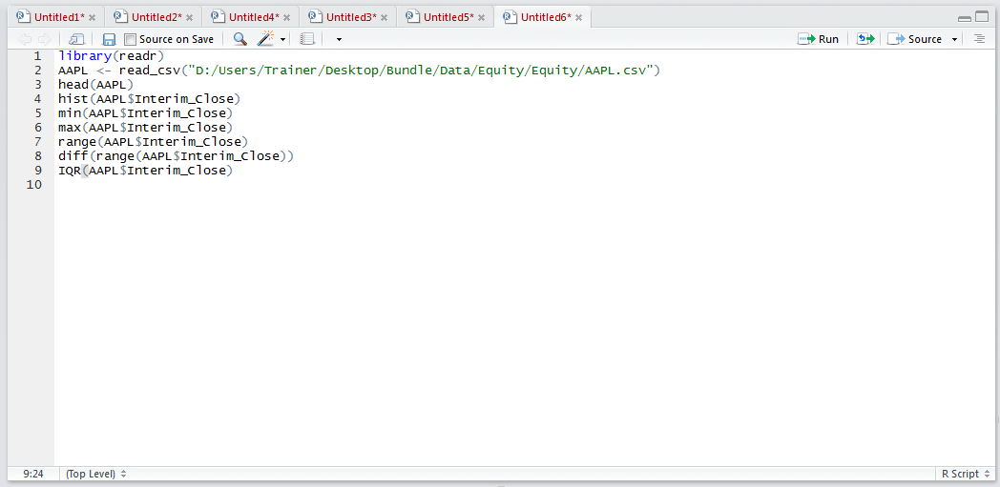
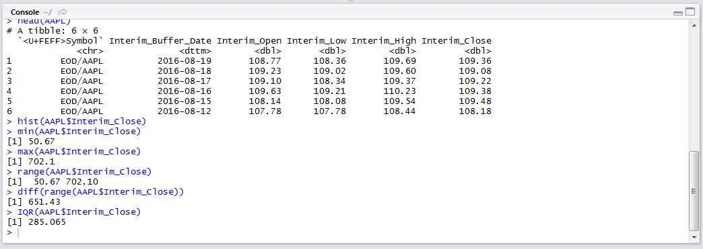
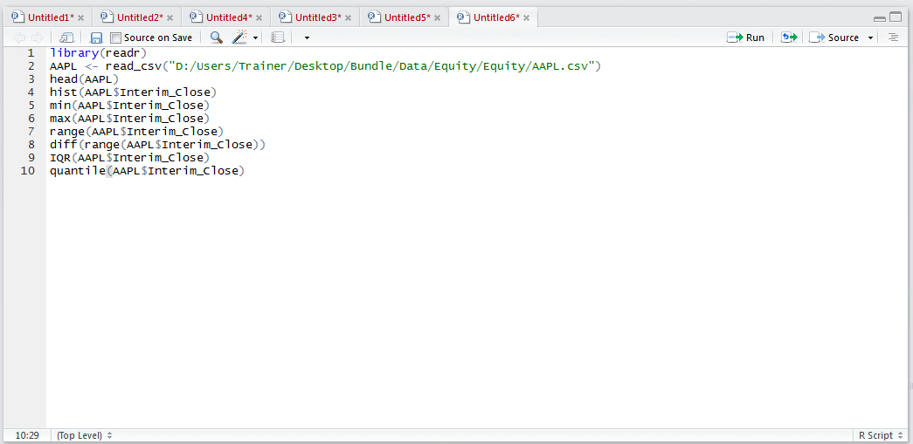
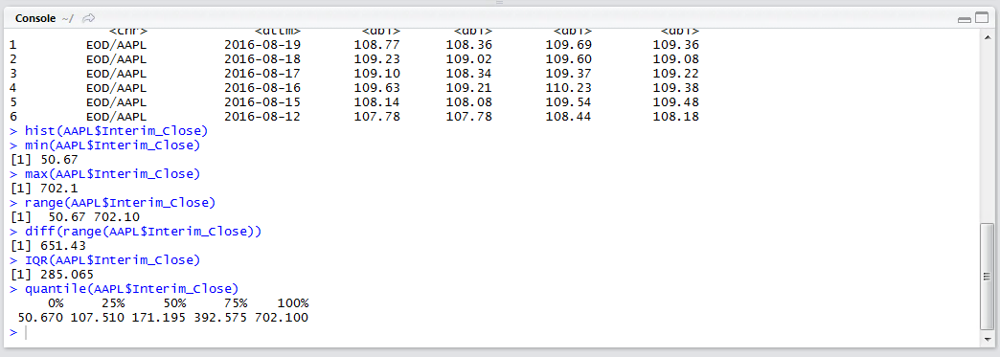

# Procedure 3: Calculate Quartiles and the Interquartile Range

Quartiles, which divides the vector up into four chunks which are equally sized, is one means to estimate spread.  The IQR() function allocates the entries in a vector and provides explanation of the thresholds, returning the range between the end of the first quartile and the start of the third quartile.  To establish quartiles type:

``` r
IQR(AAPL$Interim_Close)
```



Run the line of script to console:



To obtain more granularity around the range calculated using the IQR() function,  use the quantile() function by typing:

``` r
quantile(AAPL$Interim_Close)
```



Run the line of script to console:



The first quartile is 107.510, the second quartile is 171.195 and the third quartile is 392.575, values which provide a measure of spread and coupled with other summary statistics can support a further visualization in the form of a box plot.