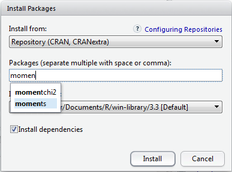
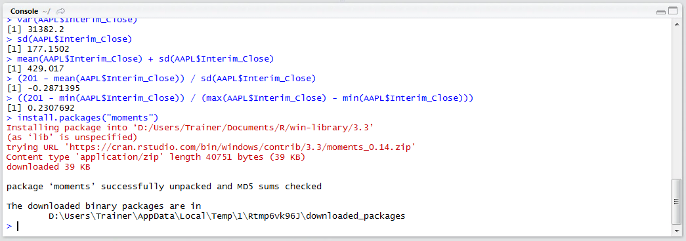
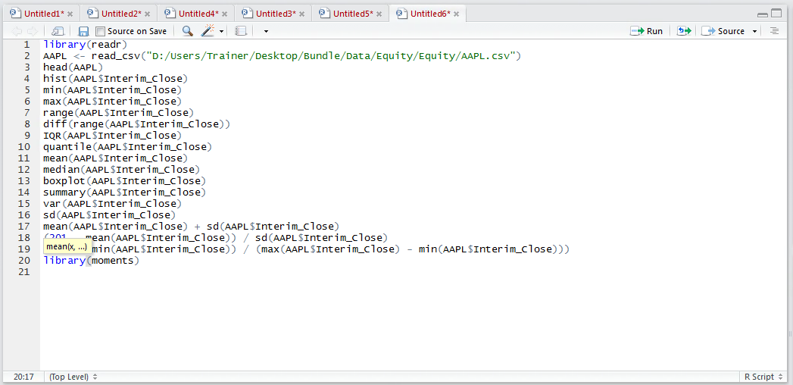
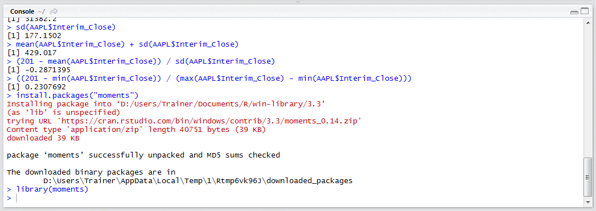
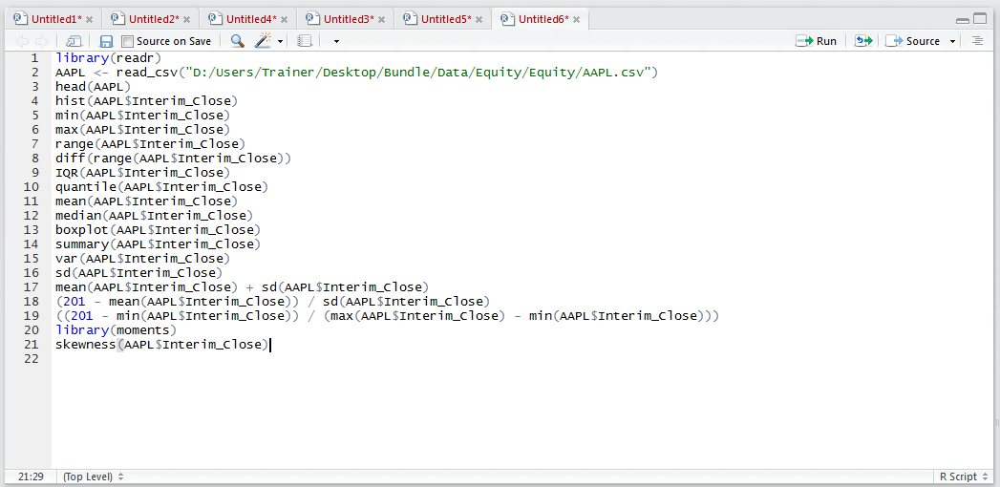
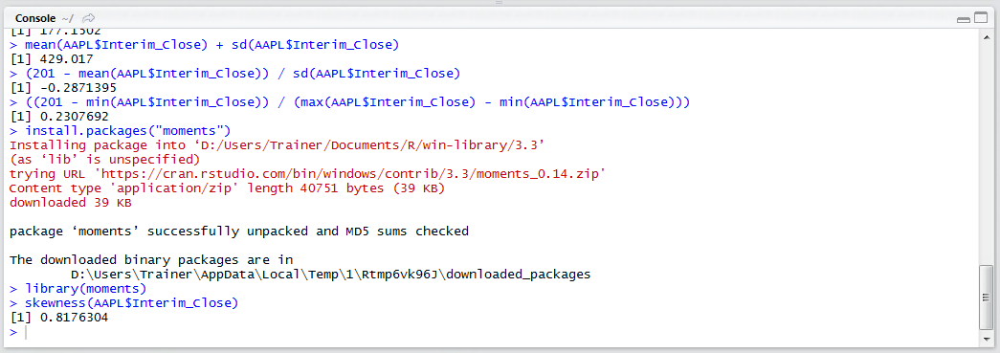
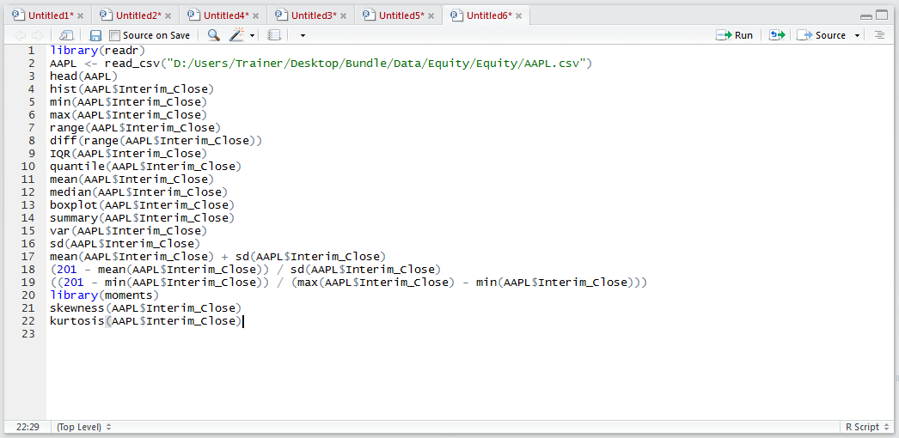
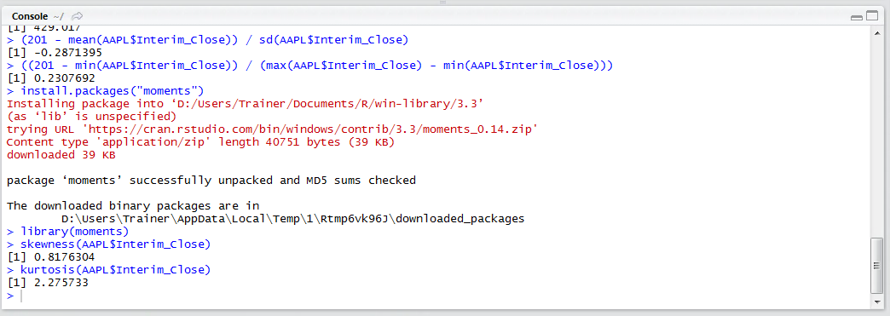
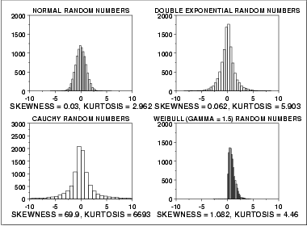

# Procedure 10: Create the Skewness and Kurtosis statistics

It can be observed from procedure 55 that the histogram has a severe lean towards the axis, which would be described as being positively skewed.   The positive skew deviating from the shape expected of a normal distribution would be cause mistrust of the standard deviation that was created in procedure 61.  Two useful statistics and functions for assessing the extent to which a distribution deviates from the normal distribution is skewness() measuring the lean towards and away from the y axis and kurtosis() measuring how tall or squashed the distribution is.

The functions skewness() and kurtosis() do not exist in the base R packages rather they are available in a package called moments.  It follows that the moments package need be installed then loaded.  Search for and install the package moments via RStudio:



Click the Install button to run the installation instruction to console:



Load the library moments by typing into the script window:

``` r
library(moments)
```



Run the line of script to console:



Firstly, in the quest to appraise the extent to which the vector leans towards or away from the axis, type:

``` r
skewness(AAPL$Interim_Close)
```



Run the line of script to console:



It can be observed that there is a positive value returned, indicating that there is indeed lean and owing to it being positive, that the lean is towards the y axis (which is of course what was visually observed in procedure 55).  Secondly to understand if the distribution is tall or squat, verify the kurtosis by typing:

``` r
kurtosis(AAPL$Interim_Close)
```



Run the line of script to console:



The kurtosis is a difficult statistic to make sense of and in many respects the skewness is a more useful statistic.  To make an assessment of the shape of the distribution, typically, all summary statistics need to be considered:

