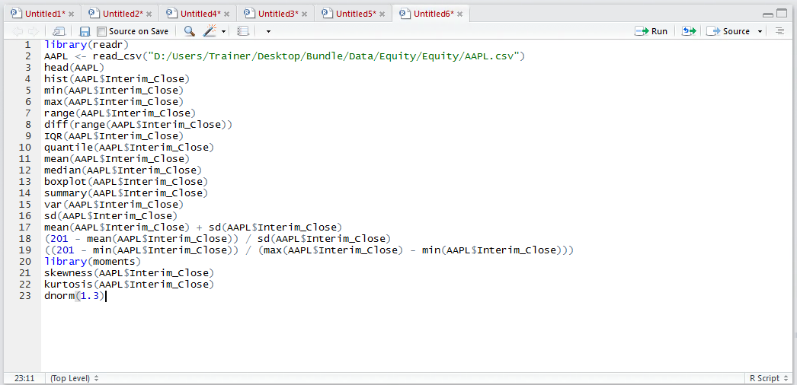
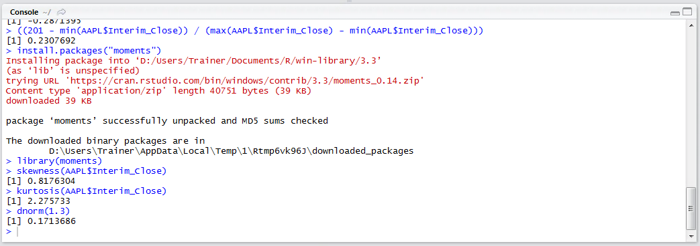
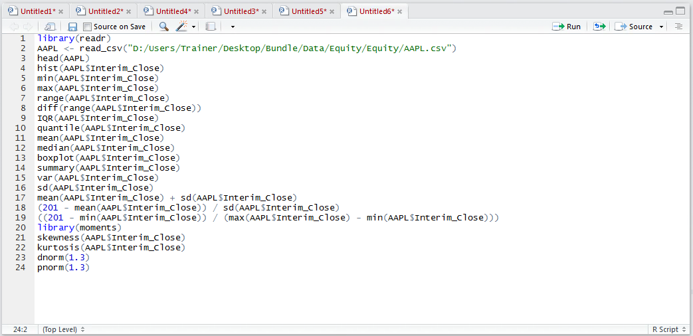

# Procedure 11: Create Probabilities from a test value in a normal distribution

One of the useful properties of a normal distribution is the ability to predict the probability of that value occurring.  Intuitively values on either end of the tail would seem to be extremely unlikely to happen and functions in R can facilitate the creation of a probability to express this.  In this procedure there are two functions that will be used to gain a sense for the probability of a particular value occurring dnorn() and pnorm() both taking the z score (the number of standard deviations away from the mean) as their arguments.  

The dnorm() function returns the position of the value on the y axis,  which has certain predictive properties when overlaid on a histogram created as per procedure 55.  Taking a value of 1.3 standard deviations from the average and returning the approximate height of the point in the y axis type:

``` r
dnorm(1.5)
```



Run the line of script to console:



A far more useful measure is of cumulative probability which, when knowing a z score, expresses the percentage probability that the value would fall somewhere below that Z score.  To obtain the cumulative probability of a value having a Z score of 1.3 being less than that value type:

``` r
pnorm(1.5)
```



It follows that this Z score and values up to and including this z score are around 90% certain.