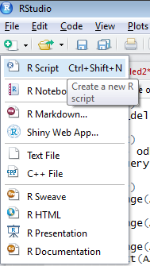
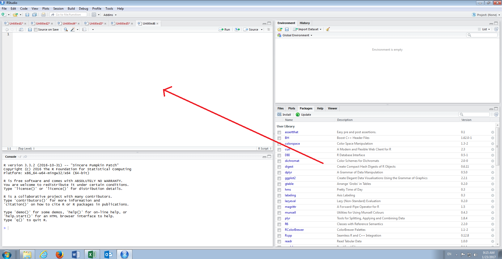
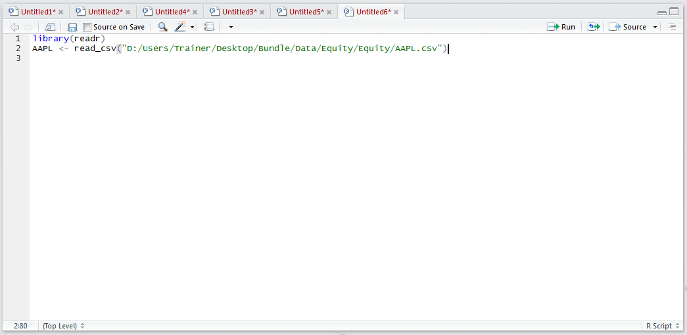
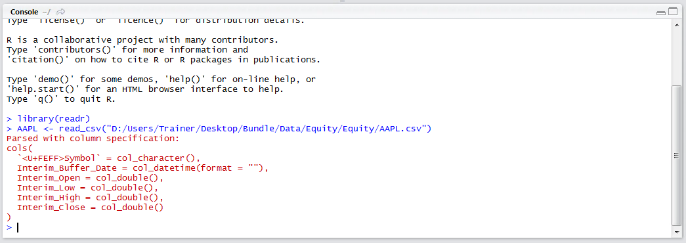
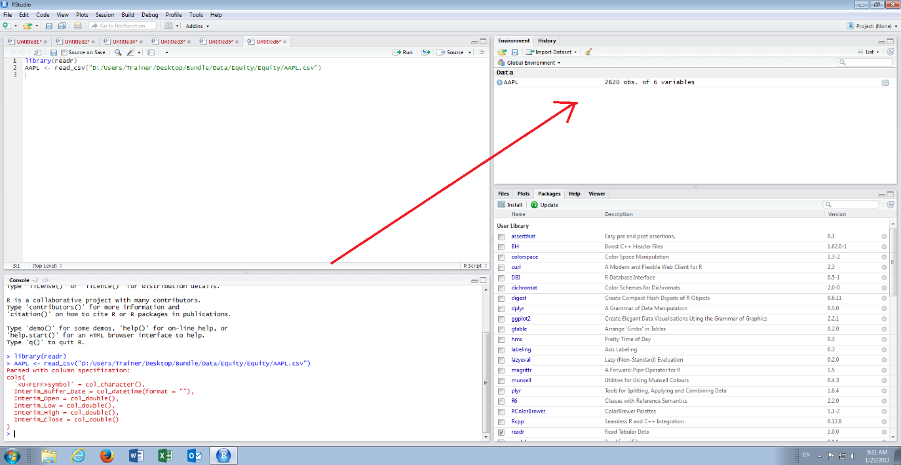
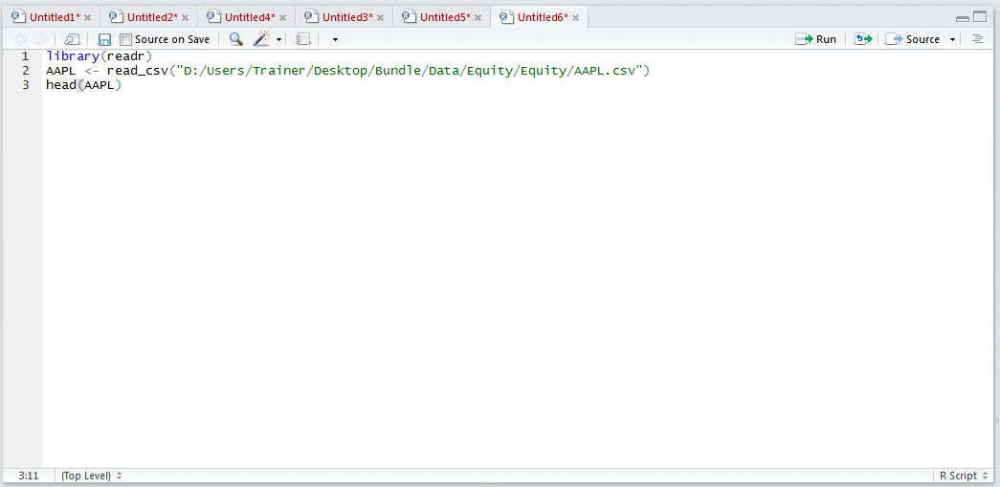
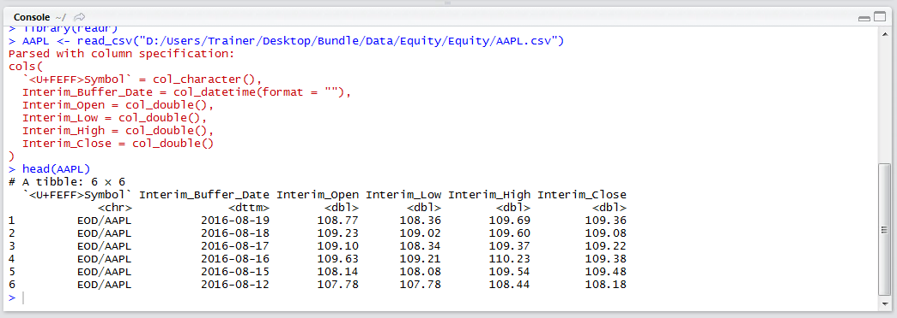
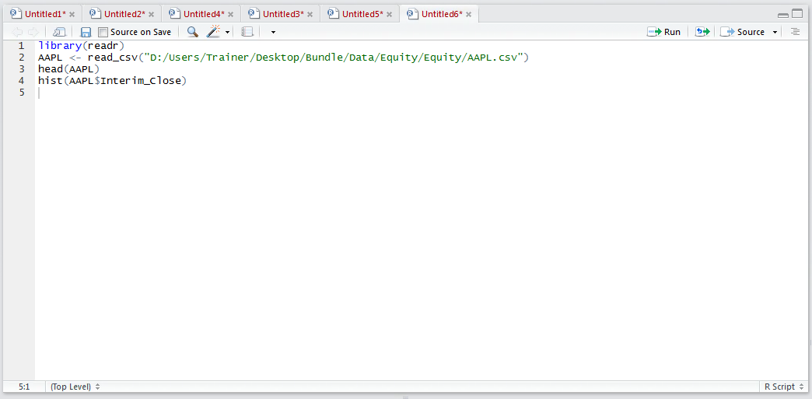
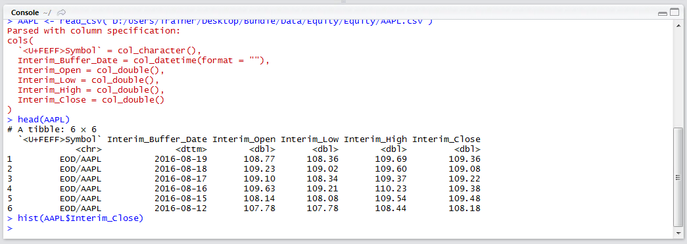
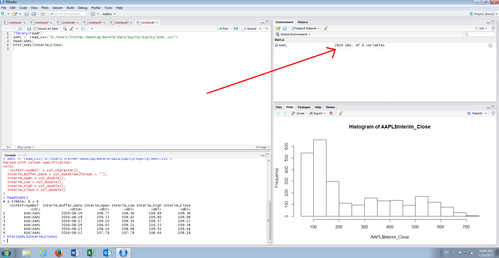

# Procedure 1: Create a Histogram of Time Series Data in R

Start this procedure by creating a new script window in RStudio by clicking on in the top left hand corner,  then clicking RScript on the submenu:



A new script window will be opened and be ready for input:



Load the AAPL.csv dataset from Bundle\Data\Equity\Equity\AAPL.csv:

``` r
library(readr)
AAPL <- read_csv("D:/Users/Trainer/Desktop/Bundle/Data/Equity/Equity/AAPL.csv")
```



It can be observed that the library readr is being loaded and therafter the read_csv() function is being used to create a data frame titled AAPL.  Run the block of script to console:



The specification has been written to console and is available in the environment pane:



As the data frame is quite large,  it is not practical to write it all out to console,  hence in this example the head() function will be used to take a peek at the data frame by typing:

``` r
head(AAPL)
```



Run the line of script to console:



It can be seen that just the top of the data frame has been returned.

For the purposes of this procedure, the column,  rather vector, of interest is the Interim_Close for which a histogram would provide some discovery capability.  To create a histogram the hist() function is used, taking the data frame and named vector:

``` r
hist(AAPL$Interim_Close)
```



Run the line of script to console:



It can be seen that a chart has been loaded to the plot section of RStudio:



The plot gives a good snap visualization of the AAPL stock price over the history, which in this case can be seen as positively skewed.  The hist() function exposes many argument to enhance the visual appearance of the histogram however for the purposes of exploration, rather than presentation, the defaults are more than adequate.
