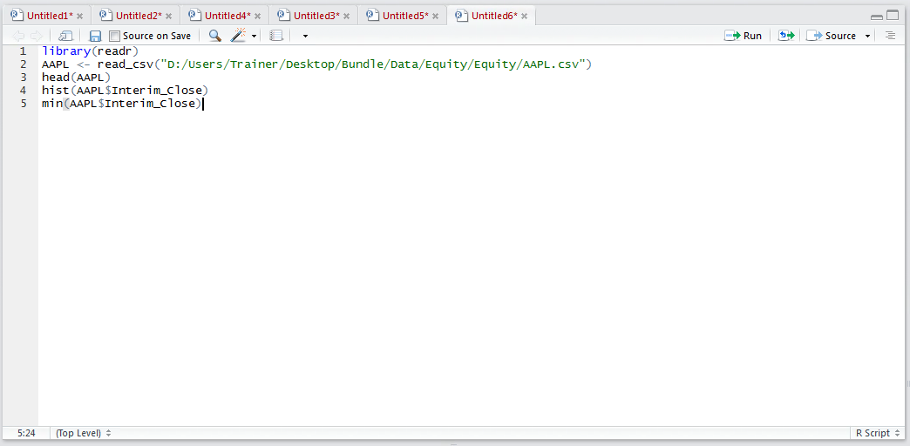
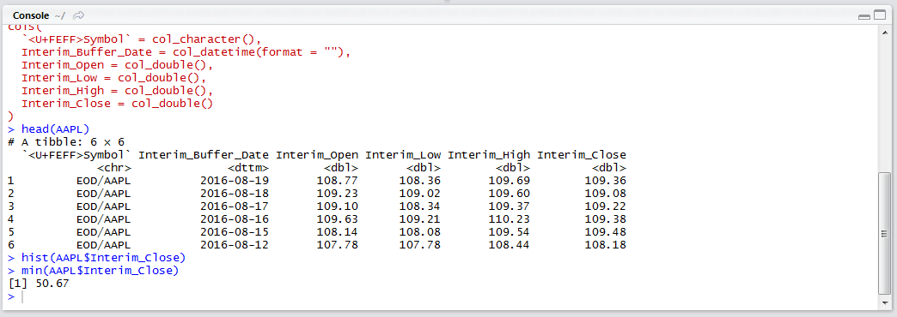
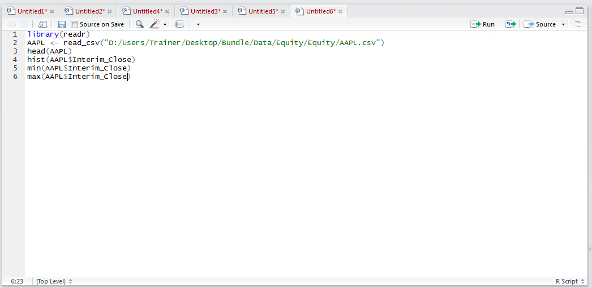
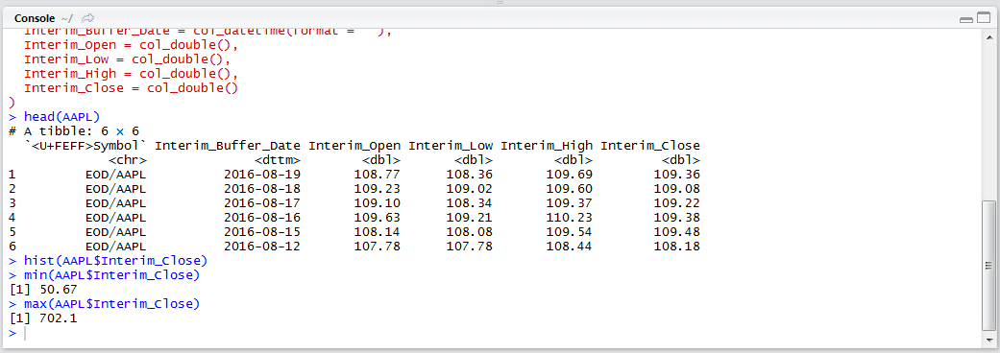
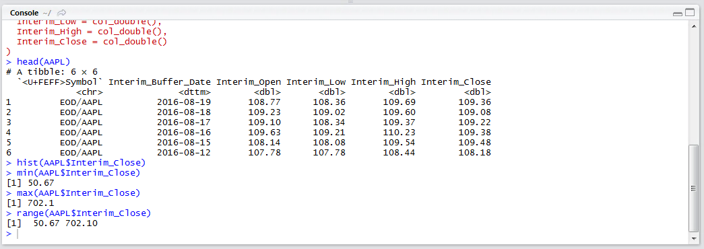
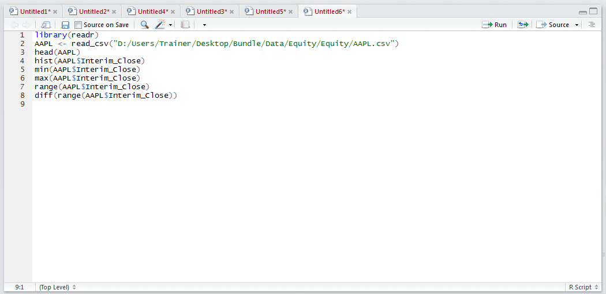
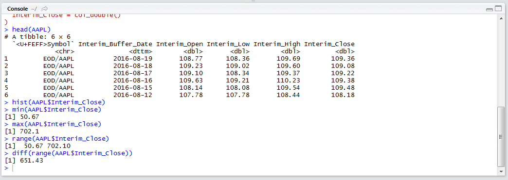

# Procedure 2: Establish Range in R

To establish the range of the Interim_Close in the AAPL data frame use the min() function typing:

``` r
min(AAPL$Interim_Close)
```



Run the line of script to console:



It can be seen that the smallest value in the Interim_Close vector of the AAPL data frame is 50.67, to retrieve the largest value use the max() function by typing:

``` r
range(AAPL$Interim_Close)
```



Run the line of script to console:



Run the line of script to console:



To establish the range value subtract the largest value from the smallest value which can be achieved by using the diff() function on the vector returned from the range() function as:

``` r
diff(range(AAPL$Interval_Close))
```



Run the line of script to console:



It can be seen that the range has been returned as being 651.43.