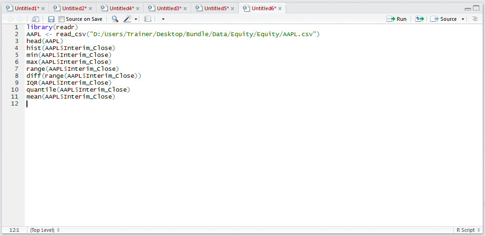
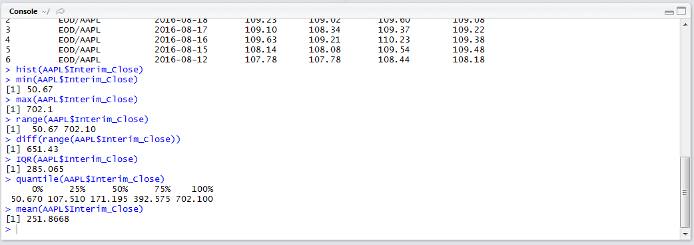
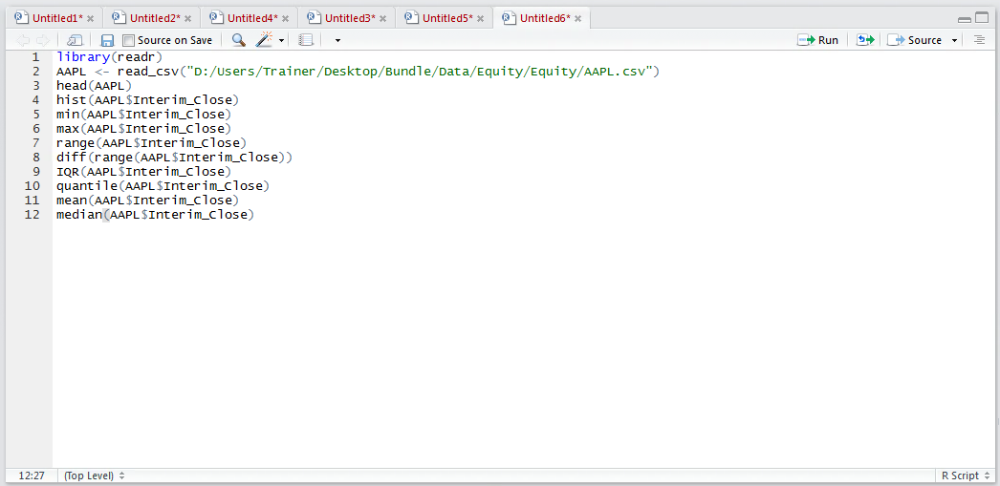
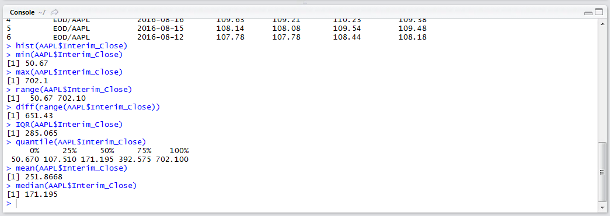

# Procedure 4: Establish the Mean and Median in R

The Mean and Median are a way to measure the central tendency of a vector.  The mean, commonly called the average, is calculated by summing up all of the values in a vector the dividing it by the count of values in the vector (i.e. 100 + 200 + 300 / 3).  The function mean() performs the calculation on a vector by typing:

``` r
mean(AAPL$Interim_Close)
```



Run the line of script to console:



The mean, or average, is output as 251.8668.  The median on the other hand is absolute middle of a histogram and can be calculated using the median() function:

``` r
median(AAPL$Interim_Close)
```



Run the line of script to console:



It can be observed that the median, the value that could be considered the centre of the distribution, is 171.195.  Taken together with procedure 57, all the values are present to create a box and whiskers plot as an alternative to a histogram as a means to understand the spread of data.