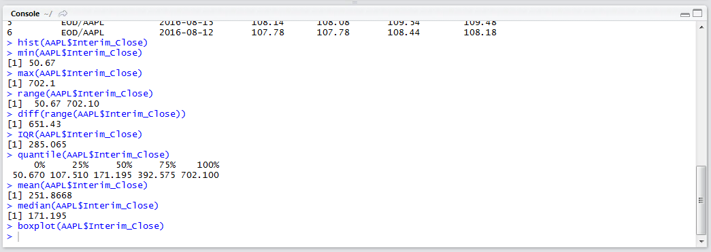
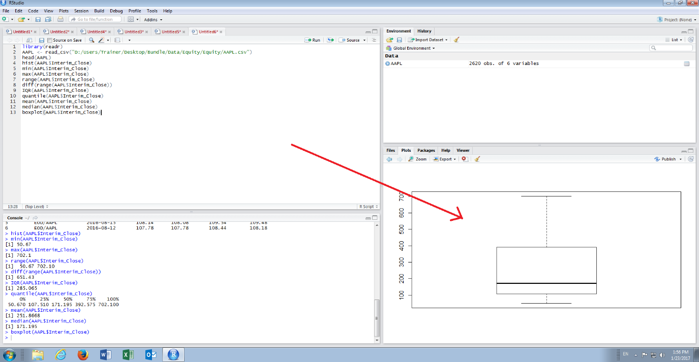

# Procedure 5: Create a Box Plot

A box plot is a five-point visualisation of several summary statistics, the Median, the Range and the Quartile Range.   The box plot allows for a quick appraisal of range and skew of the data and is an alternative to a histogram relying solely on easily reproducible summary statistics.

The boxplot() function takes a vector as its argument and produces a visualisation.  To create a Box Plot simply type:

``` r
boxplot(AAPL$Interim_Close)
```


Run the line of script to console:



The box plot is drawn in the plots window in RStudio:



The upper and lower whiskers of the Box Plot represent the minimum and maximum values observed, the upper and lower extremes of the box represent quartile 3 and 1 and lastly the thick horizontal line represents the median.  In this example, it can be observed that there is a skew, or compression, towards the lower values.