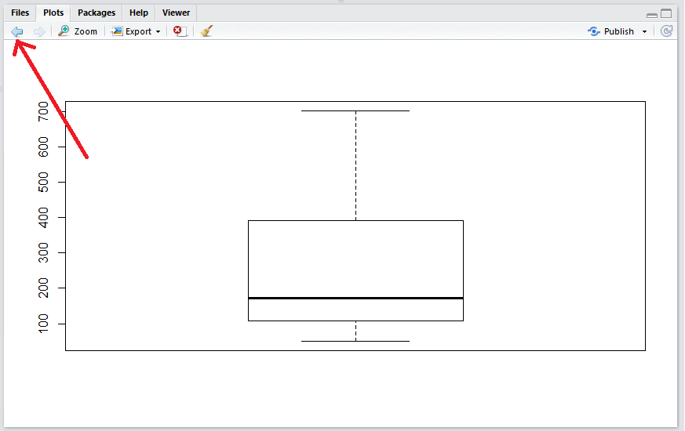
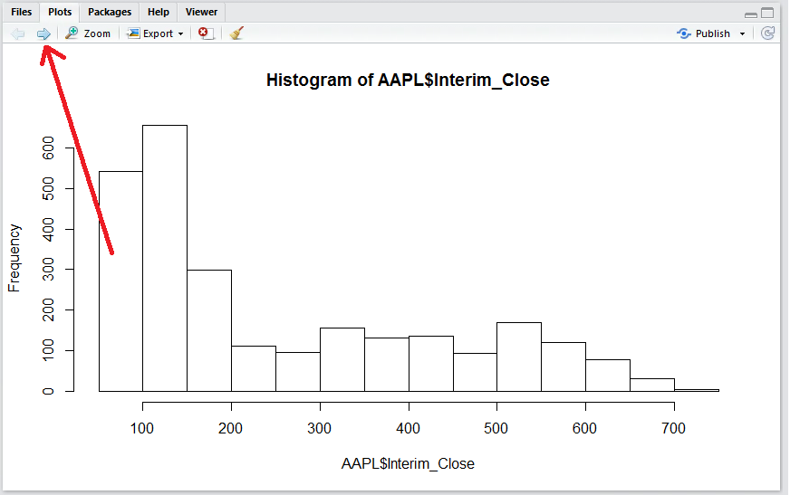
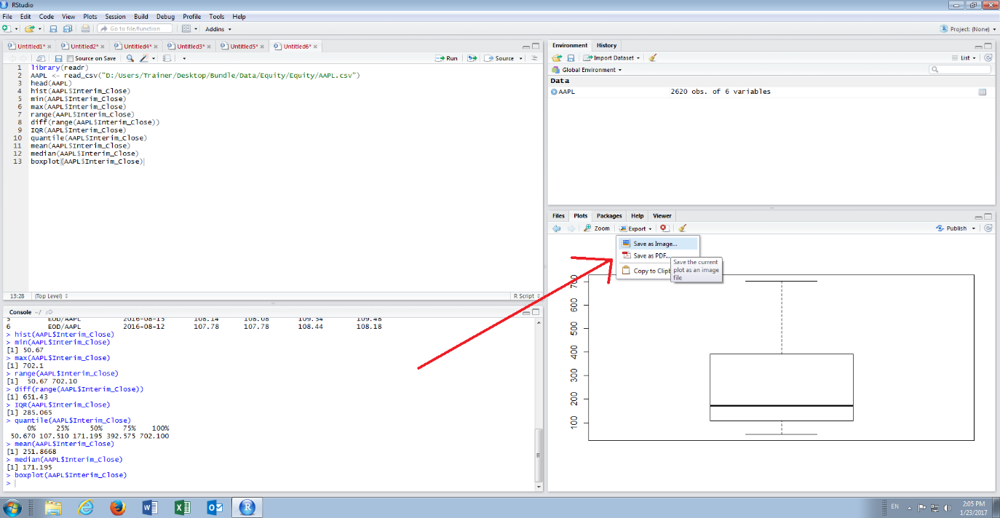
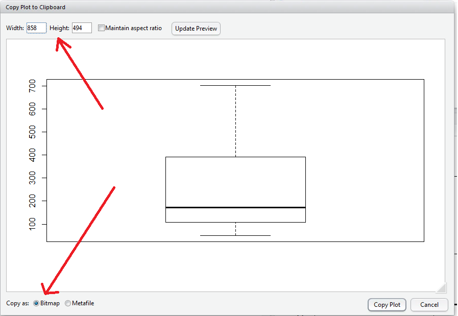
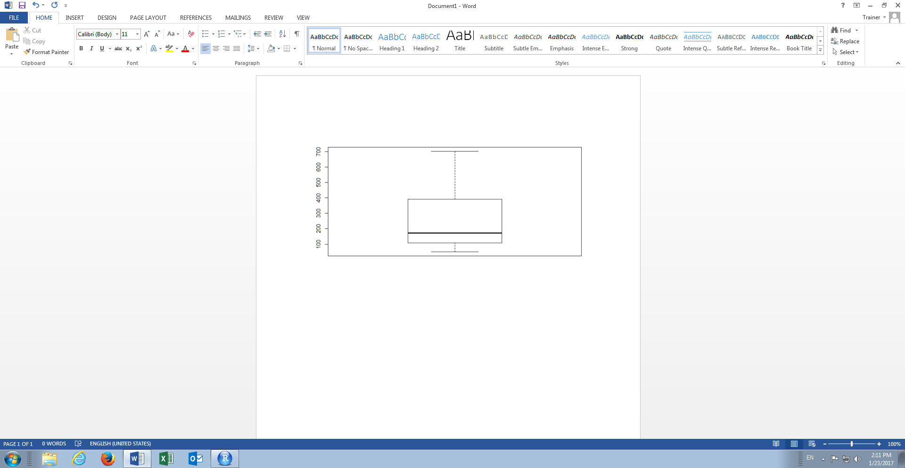

# Procedure 6: Navigate Plots and Export Visualisations

Upon the creation of a box plot at first glance it may appear as if the Histogram created has been overwritten.  Upon closer inspection, it can be seen that this is not the case as there is a back arrow, function, that allows for the paging through plots created:

Clicking on the back arrow will return to the Histogram:

Conversely the forward arrow returns to the newly created Box Plot.  RStudio provide a number of mechanisms to export the visualisation via the Export button, clicking on it presents the options:

In the drop-down there are several options to export an image from a plot, although the most versatile is to copy the visualisation to clipboard as an image for pasting into a plethora of third party applications, such as Word, via the established Copy \ Paste mechanism familiar to Windows users.  

To copy the image, click on the sub menu item Copy to Clipboard which will open a dialog box setting out the specification of the image:

Options for the creation of the image include the dimensions of the image and the precise format \ encoding, in this case the defaults are adequate as a bitmap is a suitably versatile format.  Click the Copy Plot button to copy the image to the clipboard.  The image can now be pasted into any application that can make use of a bitmap, such as Powerpoint, Word, Excel of Paint:

