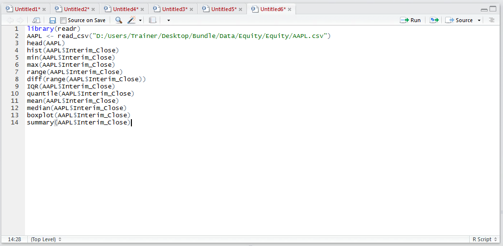
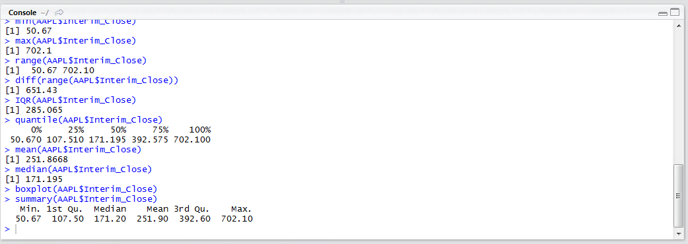
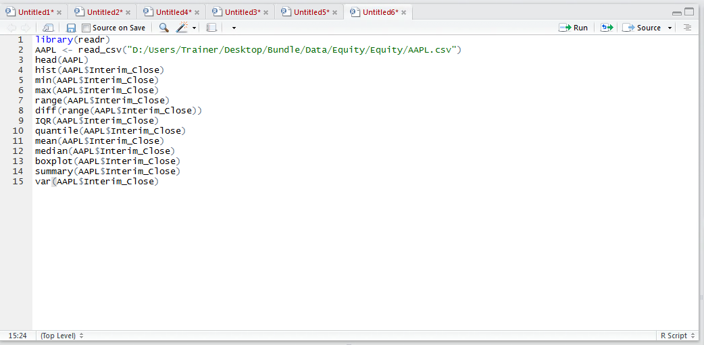
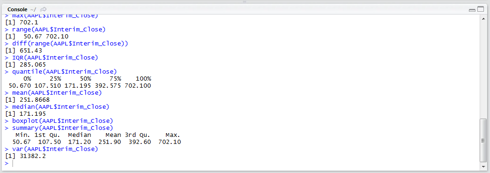
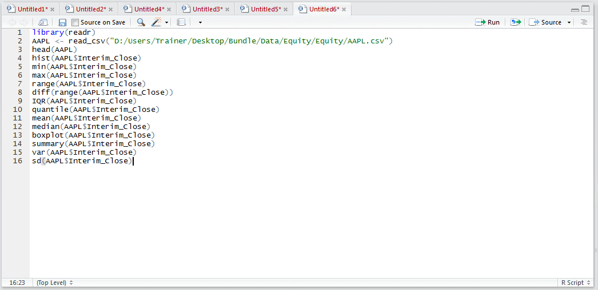
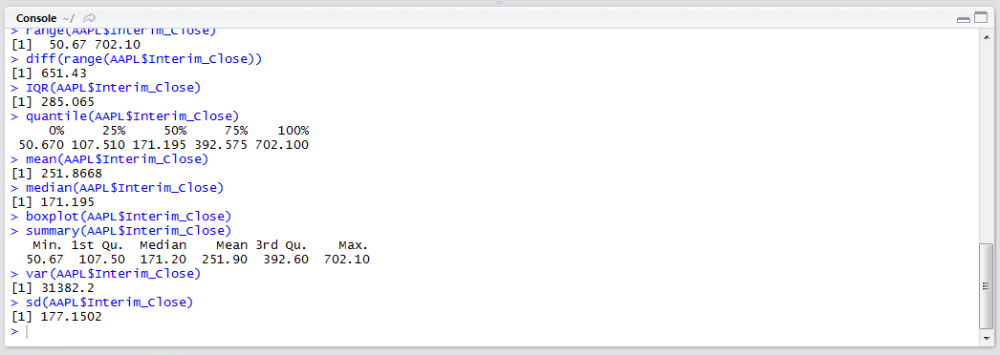
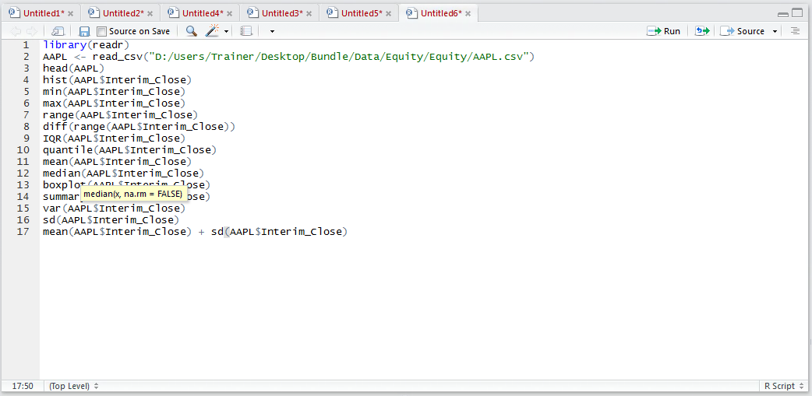
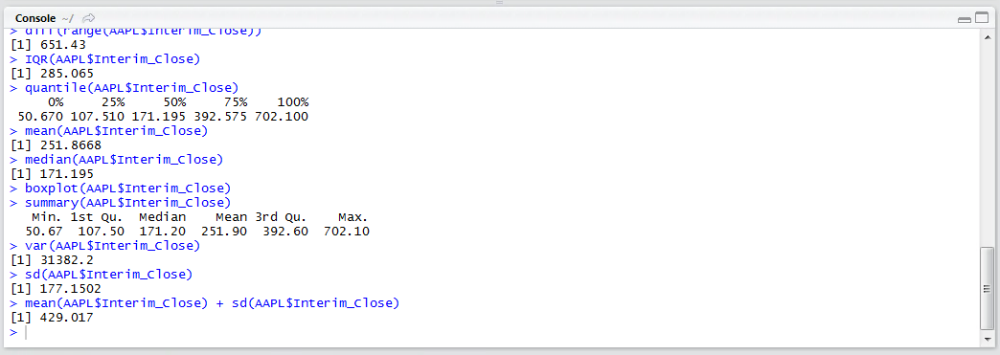

# Procedure 7: Create the Variance and Standard Deviation

The procedures presented in module 4 thus far ignores the existence of a summary() function that produces an analysis of a vector and returns the same summary statistics.  To return the summary statistics in this manner type:

``` r
summary(AAPL$Interim_Close)
```



Run the line of script to console:



It can be seen that many of the summary statistics produced one by one are written out to a vector as the result of the summary() function.  There is a conspicuous absence of the Variance and Standard Deviation measures in the summary function which calls for the use of the sd() and var() functions.  To review the variance of a vector type:

``` r
var(AAPL$Interim_Close)
```



Run the line of script to console:



The variance calculation takes the difference between each value and the overall mean, squares it, then takes an average of that.  In this case the variance is 3182.2, it could be said that the larger the value the more it varies.  The standard deviation, a more useful statistic is simply the square root of the variance.  It is more practical to go straight to the Standard Deviation by typing:

``` r
sd(AAPL$Interim_Close)
```



Run the line of script to console:



The standard deviation in this example is 177.1502, a value which has special meaning as adding this to the mean of 251.8668 as produced in procedure 58, it can be said (in a normal distribution at least) that 68.2% of all values will live in the range between 0 (as we can’t go below zero) and 429.017.  The fact that the lower band is below 0 leads to inference that the distribution is not normally shaped, which is known already from procedure 55, where the vector was plotted to a histogram and box plot.

To create an upper band, this being a single Standard Deviation from the Mean:

``` r
mean(AAPL$Interim_Close) + sd(AAPL$Interim_Close)
```



Run the line of script to console:

