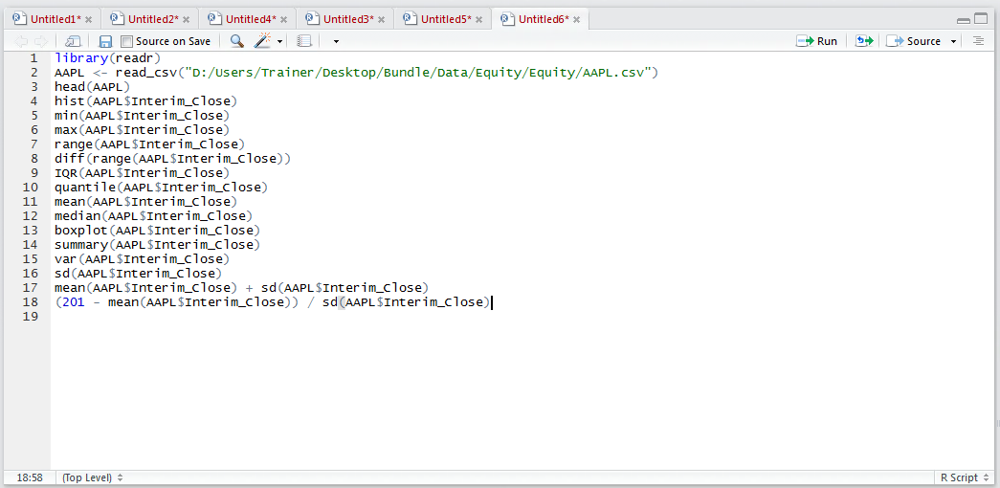
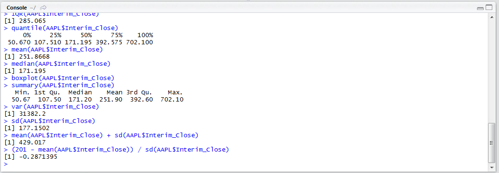

# Procedure 8: Calculate a Z Score

A calculation was performed representing one standard deviation.  A Z Score takes a value then expresses how many standard deviations that value is from the mean.  For the purposes of this example, the value to appraise is 201.  The formula to calculate how many standard deviations from the mean the value 201 is (201 – Mean) / Standard Deviation.

To identify the Z score of the value 201 type:

``` r
(201 - mean(AAPL$Interim_Close)) / sd(AAPL$Interim_Close)
```



Run the line of script to console:



In this example, it can be seen that the value 201 is quite close to the mean being a mere 0.28 standard deviations away from the average.  However, as presented in procedures preceding the calculation of the Z score, there are some issue in the way the data is distributed casting some doubt on the relevance of the standard deviation.