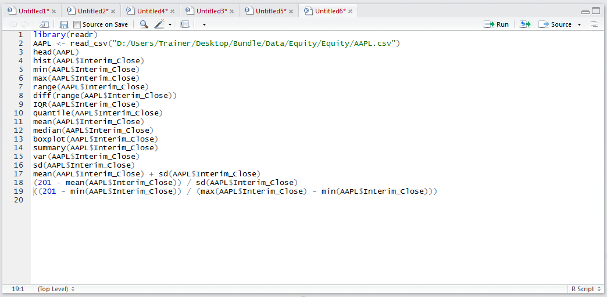
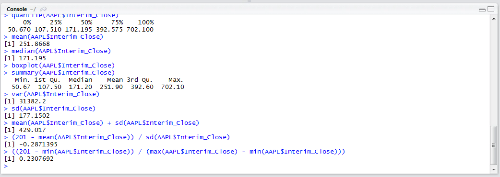

# Procedure 9: Create a Range Normalisation for a Value

A useful normalisation is to appraise a value against a scale from the smallest to the largest value.  The formula for range normalisation, as in procedure 56 taking the value 201 to be test, is (201 – min) / (max – min) where the minimum and maximum values as calculated as in procedure 56.  To test where the value 201 exists on a scale between the minimum and maximum value:

Run the line of script to console:

The output shows that the test value of 201 exists at a point of 23% between the minimum and maximum value observed in the vector.