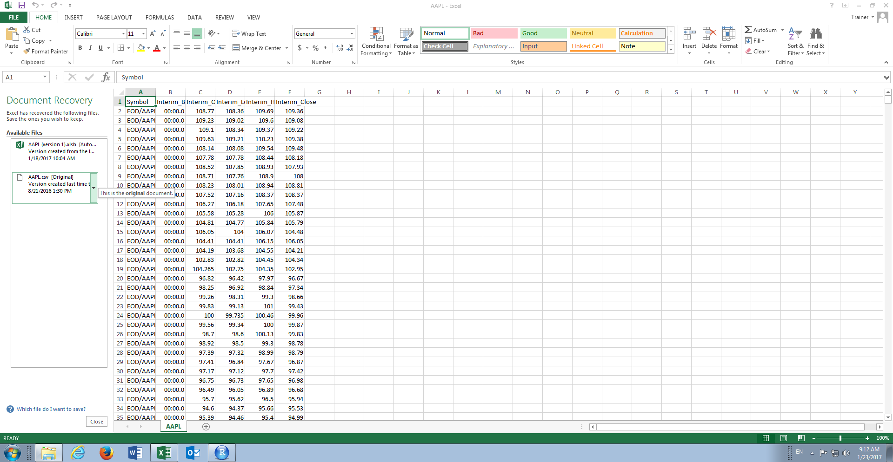

# Module 5: Summary Statistics and Basic Plots in R

Summary statistics refer to the creation of commonly used aggregate statistics from a data frame, in this case a data frame of AAPL prices for the last ten years.  In this module R will be used to load the AAPL prices then explore this data using summary statistics and some rudimentary plots.

The data file to be used is the AAPL.csv file located in Bundle\Data\Equity\Equity\AAPL.csv:

The module seeks to emulate many of the functions available to Excel Analysis Toolpack or StatTools in R.

