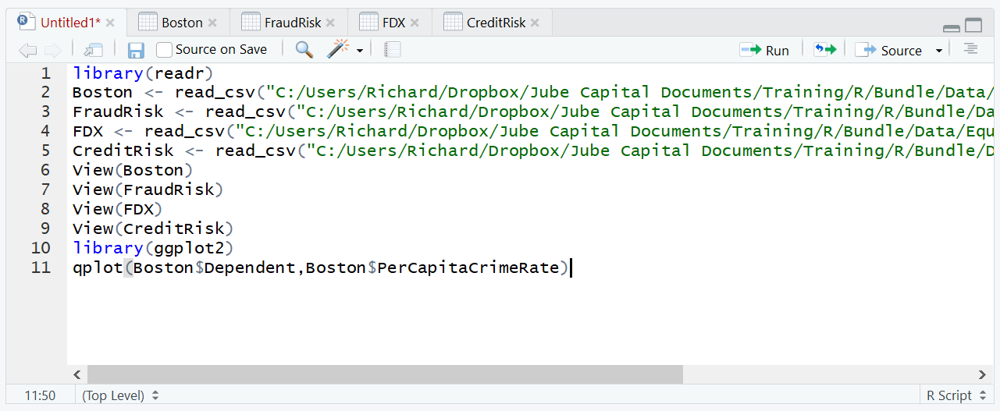
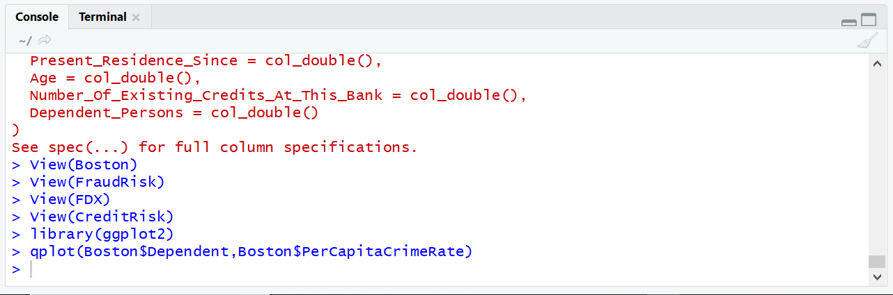
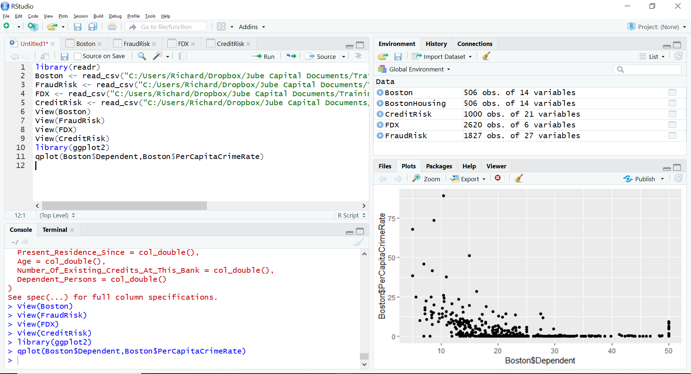

# Procedure 1: Quickly Creating a Scatter Plot with qplot()

The following procedure will show how the QPlot() function can be used in a similar manner as the plot() function to create a scatter chart.  To create a scatter plot that compares the PerCapitaCrimeRate to the House prices in the Boston Housing dataset:

``` r
qplot(Boston$Dependent,Boston$PerCapitaCrimeRate)
```



Run the line of script to console:



It can be seen that the plot is available in RStudio:



The plot bears stark resemblance to the product of the base R graphics plot() function,  except the rendering quality is of better quality. This is common for all of the charts explained as follows.