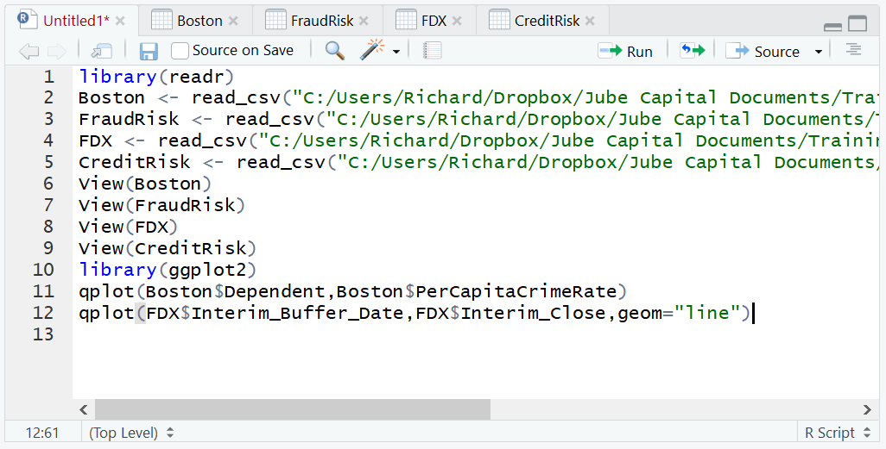
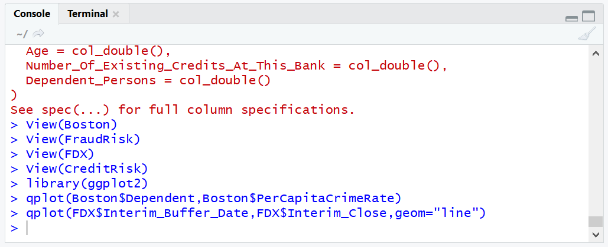
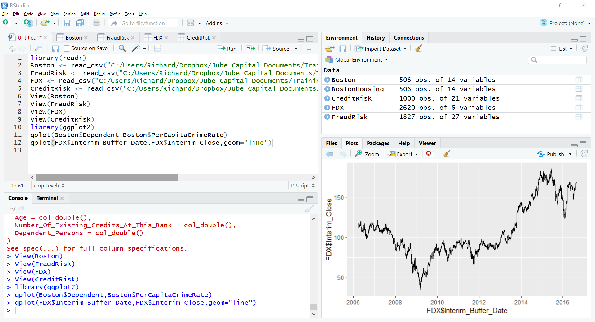

# Procedure 2: Quickly Creating a Line Chart with qplot()

Displaying a stock price over time is a convenient example to show the functionality of qplot when used to make a line chart.  In this example, the FedEx stock price is going to be plotted over time.  As with the scatter plot example, the qplot function takes two vectors, however, the geom parameter will be used to specify the type of chart, in this case "line".  To create a time series line chart, pass a date (Interim_Date) and the price (Interim_Close):

``` r
qplot(FDX$Interim_Buffer_Date,FDX$Interim_Close,geom="line")
```



Run the line of script to console:



It can be observed that the chart has been rendered to the plots section of RStudio:



This procedure should exhibit that qplot has default of a scatter chart, however it can be easily changed to other types by varying the geom parameter.