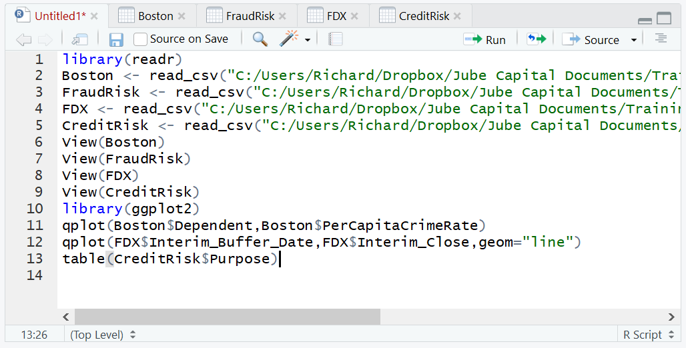
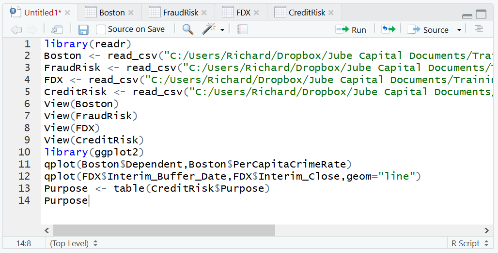
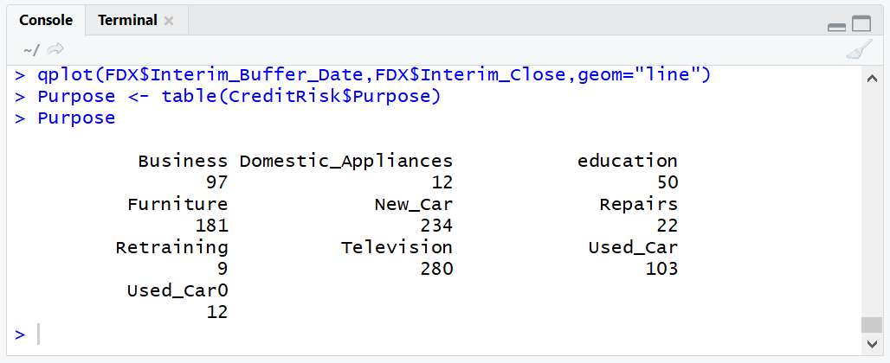
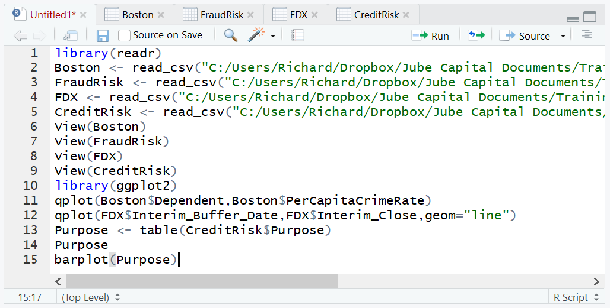
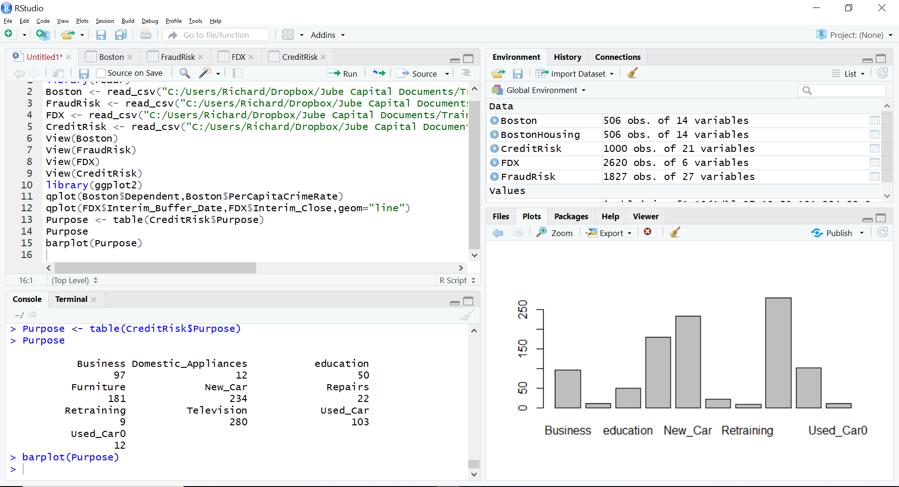
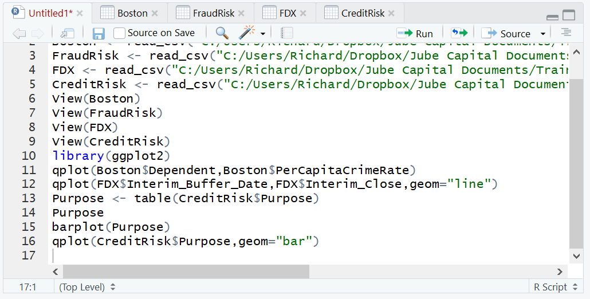
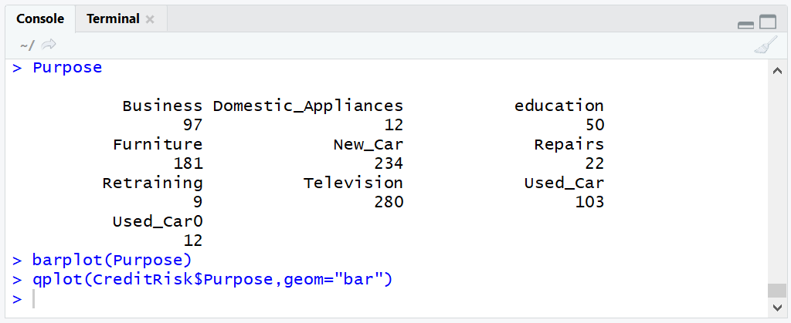
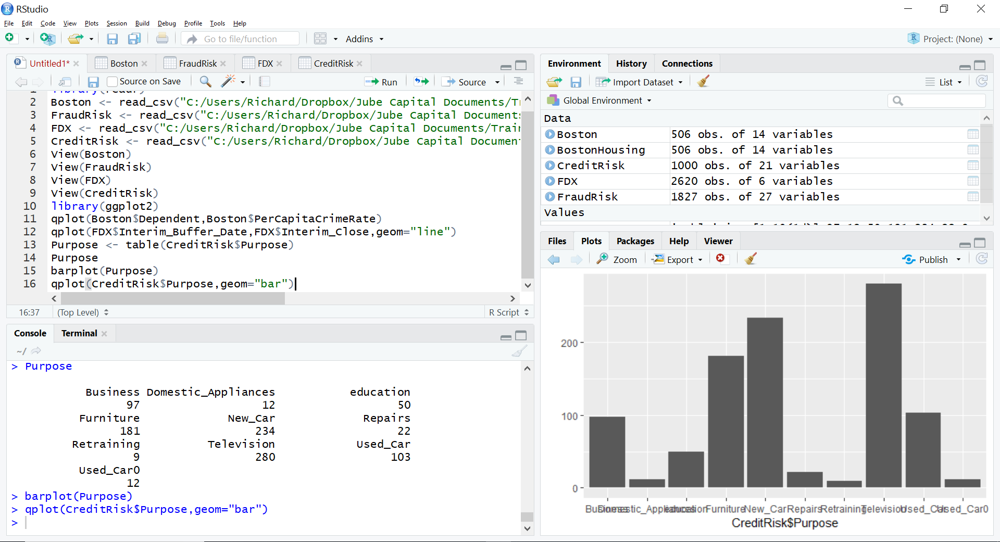

# Procedure 3: Quickly Creating a Bar Chart with qplot()

To create a bar chart in Base R it is necessary to perform some pre-aggregation of values.  A useful function, used extensively in subsequent procedures, is the table() function.  The table() function will scan a vector and allocate counts for the distinct values available in that vector.

In this example the CreditRisk dataset is going to be used to present a bar chart of the frequency of each loan purpose.  Firstly, create a table of the loan purpose to show the original method of bar chart creation and the functionality of the table() function:

``` r
Purpose <- table(CreditRisk$Purpose)
```



Write the table to console:

``` r
Purpose
```



Run the line of script to console:



It can be observed that the frequencies have been apportioned next to the loan purpose vector.  This table can then be passed to the base R function barplot():

``` r
barplot(Purpose)
```



Run the line of script to console:



It can be seen that the bar chart has been written out to the plots area of RStudio.  Using qplot() it is however possible for the aggregation to take place by simply passing two vectors in the same manner as a scatter plot, simply specifying the geom parameter to be "bar":

``` r
qplot(CreditRisk$Purpose,geom="bar")
```



Run the line of script to console:



In the RStudio plots pane it can be seen that a bar chart has been created without the need to aggregate using a table:

