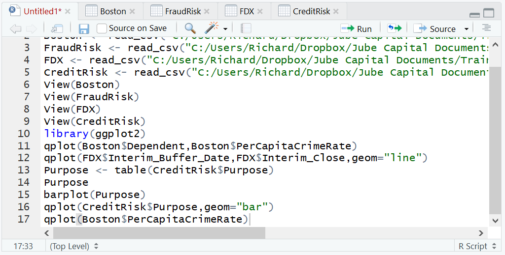
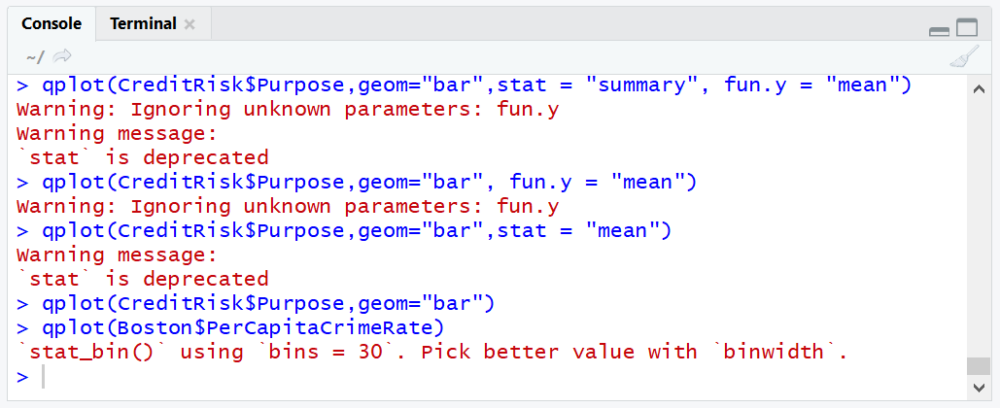
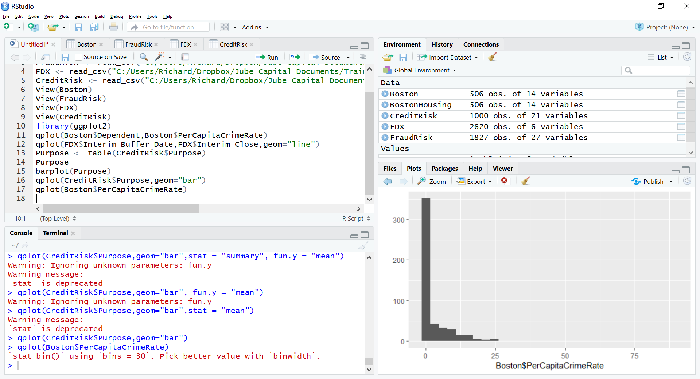
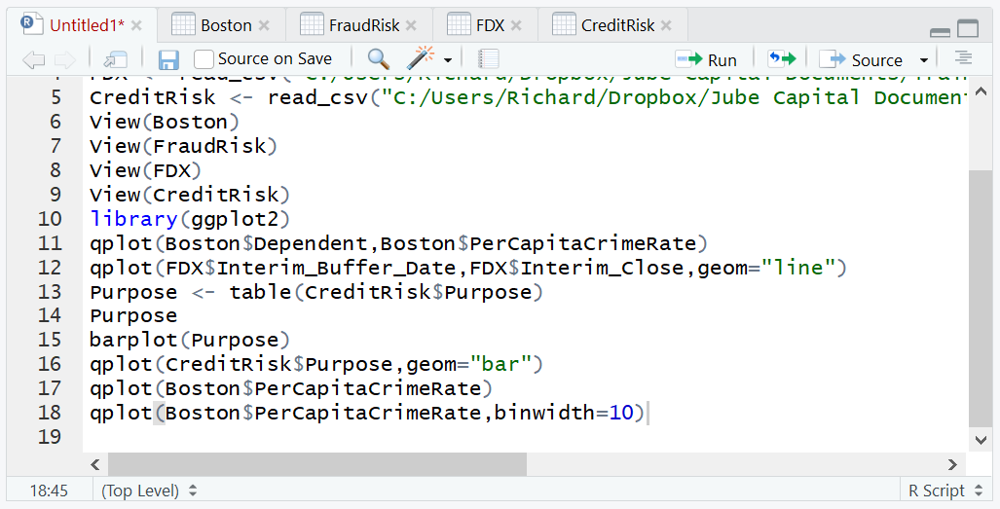
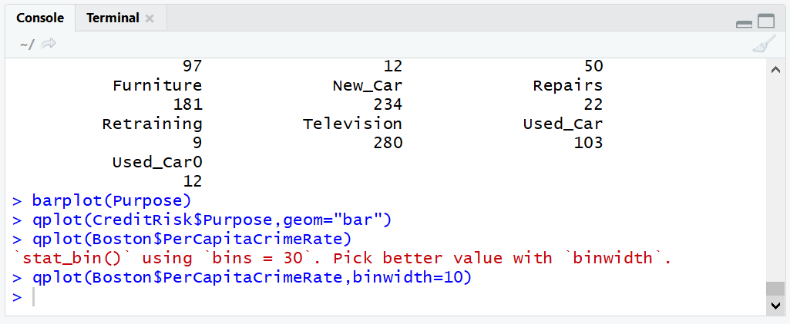
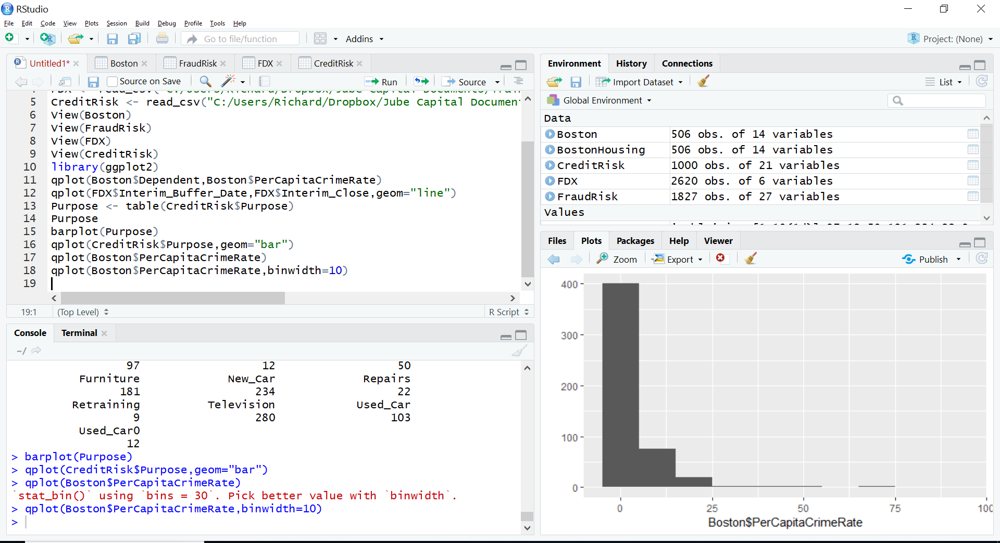

# Procedure 4: Quickly Creating a Histogram with qplot()

The qplot() histogram bears resemblance to the hist() function,  being called almost identically:

``` r
qplot(Boston$PerCapitaCrimeRate)
```



Run the line of script to console:



It can be seen that an error message has been created suggesting that the bin width is too wide, which is clearly the case in the plot being written out with a very wide scale:



Specifying the binwidth parameter of the qplot function solves the issue of their being too many bins by widening the size of the bins:

``` r
qplot(Boston$PerCapitaCrimeRate,binwidth=10)
```



Run the line of script to console:



It can be seen that a histogram has been plotted in RStudio, with fewer bars owing to the distances for the bars being wider:

