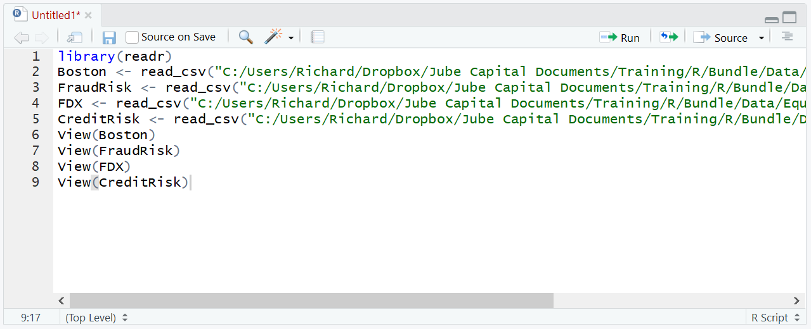
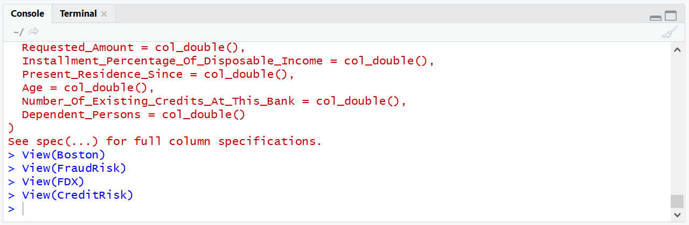
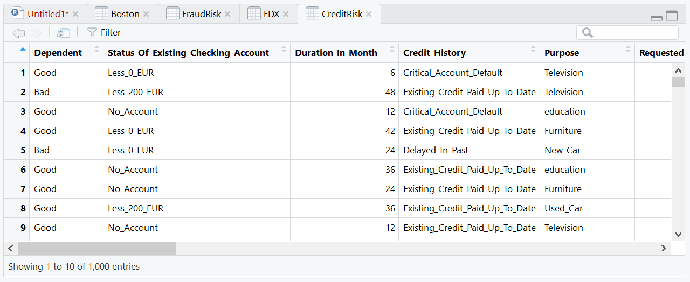
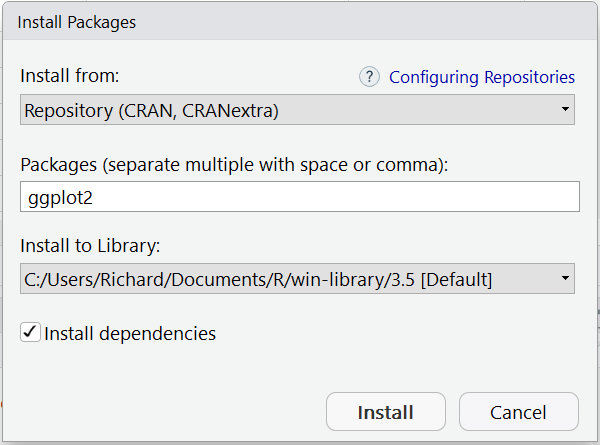
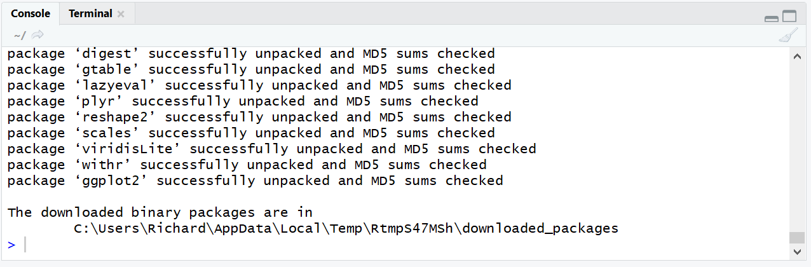
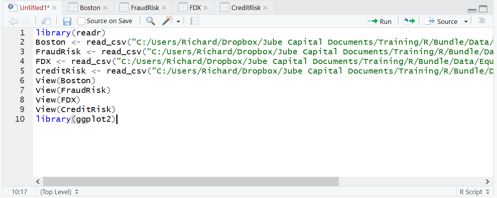
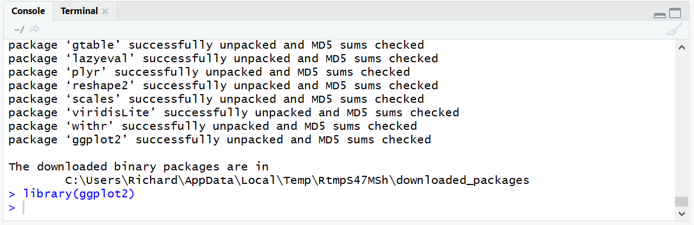

# Module 6: ggplot2 Rapid Exploration

Up to this point in the procedures the plot() and hist() function has been used, which invokes the base graphics function of the R software.  It can't be said that base R graphics have the aesthetic properties of charts produced by rivals such as Excel and leaves a lot to be desired for the purposes of presentation.  Fortunately, there is a more powerful package that is available in R for producing stunning charts that will be at home in any presentation, ggplot2.

It should be noted that R, in our orbit, is predominately used for the rapid exploration of data and the creation of models only and these procedures focus only on what is adequate to achieve that aim.

The following datasets are going to be used in this module:

* BostonHousing.csv.
* CreditRisk.csv.
* FDX.csv (FexEx Stock Prices)
* FraudRisk.csv

Before beginning these procedures, ensure that each of the files has been loaded with the following script:

``` text
library(readr)
Boston <- read_csv("C:/Users/Richard/Dropbox/Jube Capital Documents/Training/R/Bundle/Data/Boston/Boston.csv")
FraudRisk <- read_csv("C:/Users/Richard/Dropbox/Jube Capital Documents/Training/R/Bundle/Data/FraudRisk/FraudRisk.csv")
FDX <- read_csv("C:/Users/Richard/Dropbox/Jube Capital Documents/Training/R/Bundle/Data/Equity/Equity/FDX.csv")
CreditRisk <- read_csv("C:/Users/Richard/Dropbox/Jube Capital Documents/Training/R/Bundle/Data/CreditRisk/German/CreditRisk.csv")
View(Boston)
View(FraudRisk)
View(FDX)
View(CreditRisk)View(Boston)
```



Run the block of script to console:



The required datasets will be loaded into the R session and displayed in tabs as a consequence of the View() function being recalled on each data frame:



All of the procedures as follows make use of the ggplot2 package, hence it is necessary to install the ggplot2 package using RStudio:



Clicking install will download and install the package:



To reference the library:

library(ggplot2)



Run the line of script to console:



The RStudio environment is now configured to use the qplot() function and other ggplot2 package functions.