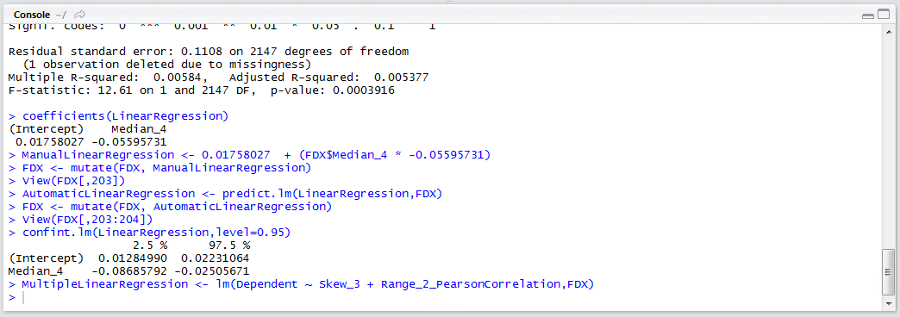

# Procedure 10: Create a Stepwise Linear Regression Model

A stepwise Linear Regression model refers to adding independent variables in the order of their correlation strength in an effort to improve the overall predictive power of the model.  Referring to the output of procedure 87:


It can be seen that the next strongest independent variable, when taking a Pearson correlation is Skew_3 followed by Range_2_Pearson_Correlation.  The process of forward stepwise linear regression would be adding these variables to the model one by one, seeking improvement in the multiple r while retaining good P values.  To create a multiple linear regression model of the strongest correlating independent variables:

``` r
MultipleLinearRegression <- lm(Dependent ~ Skew_3 + Range_2_PearsonCorrelation)
```


Run the line of script to console:



Write the summary out to observe the multiple R:

``` r
summary(MultipleLinearRegression)
```


Run the line of script to console:


Several statistics are of interest in the multiple linear regression.  The first is the p values relating to the overall model and the independent variables, each of these references scientific notation and so we can infer that it is an extremely small number far below the 0.05 cut off that is arbitrarily used.  Secondarily, the multiple R statistic is of interest, which will be the target of improvement in subsequent iterations.

The next step is to add the next strongest correlating independent variable, which is PointStep_5_PearsonCorrelation:

``` r
MultipleLinearRegression <- lm(Dependent ~ Skew_3 + Range_2_PearsonCorrelation + PointStep_5_PearsonCorrelation)
```


Run the line of script to console:


In this example, it can be seen that the R squared has increased, so it can be inferred that the model has improved, while the p values are still extremely small. A more relevant value to pay attention to would be the adjusted R, which takes into account the number of independent variables and writes the multiple r accordingly, as such it is prudent to pay close attention to this value.

Repeat the procedure until such time as the improvement in multiple r plateaus or the performance of the P values decreases.