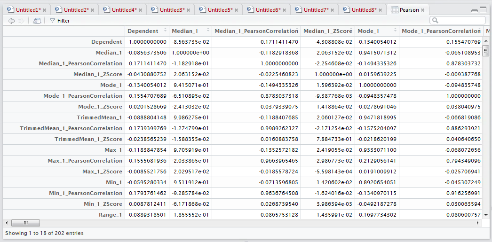
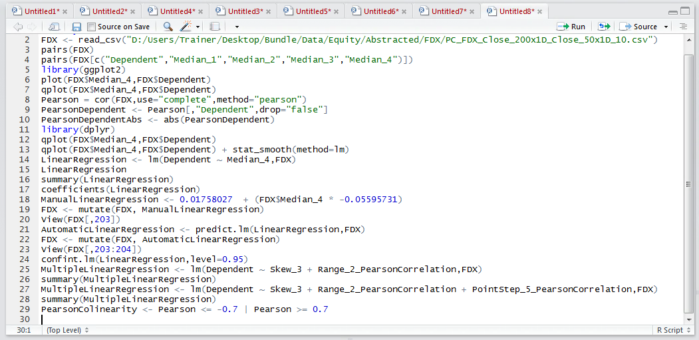
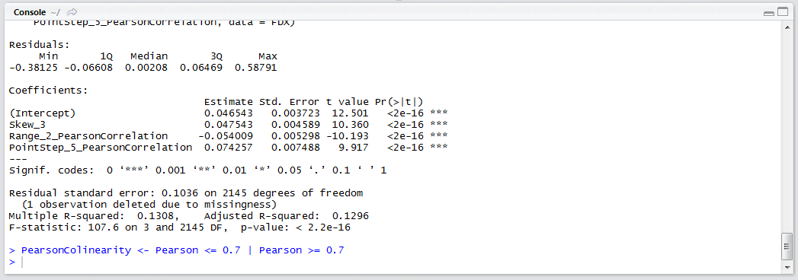
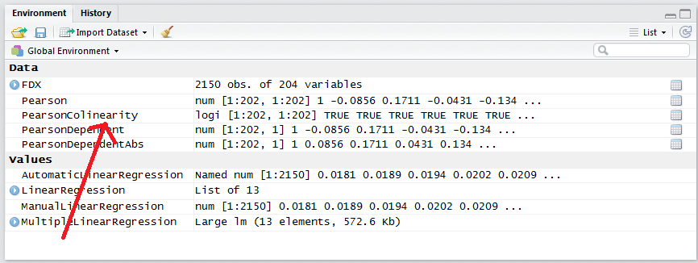
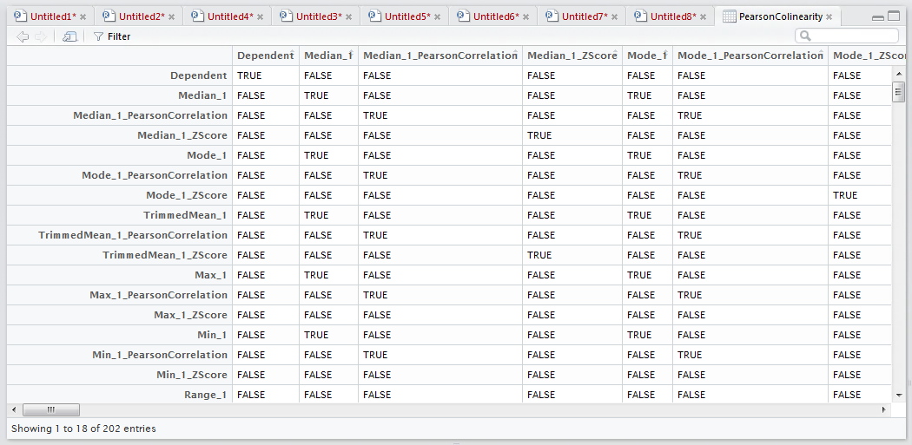

# Procedure 11: Heat Map Correlation Matrix

Multicollinearity refers to an Independent variable that while having a strong correlation to the Dependent Variable, also has an often-unhelpful correlation to another variable, with that variable also being quite well correlated to the Dependent Variable.

Multicollinearity can cause several issues, the most significant is the understatement of Independent Variable coefficients that would otherwise have a remarkable contribution to a model. 

Multicollinearity is identified with the help of a Correlation Matrix, which has hitherto been used to identity the relationship between the Independent Variable and the Dependent Variable only.

From procedure 86 there exists a large correlation matrix:



The task is to use matrix logic to identify correlations which exceed 0.7 or is below -0.7 (as both extremes of +1 and – 1 are equally troubling in this example).  The statement will use the or operator (i.e. |) and create a new correlation matrix:

``` r
PearsonColinearity <- Pearson <= -0.7 | Pearson >= 0.7
```



Run the line of script to console:



It can be seen that a new matrix has been created in the environment pane:



A click returns the matrix:



This matrix now shows, with a TRUE statement, any variable combination which may suggest collinearity and requiring further inspection.