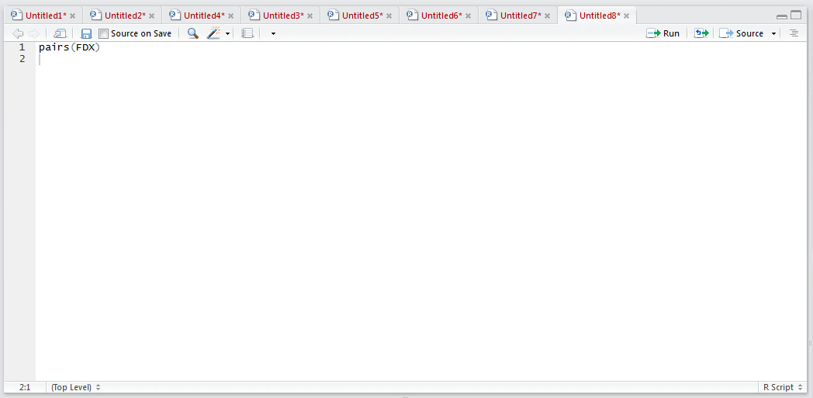
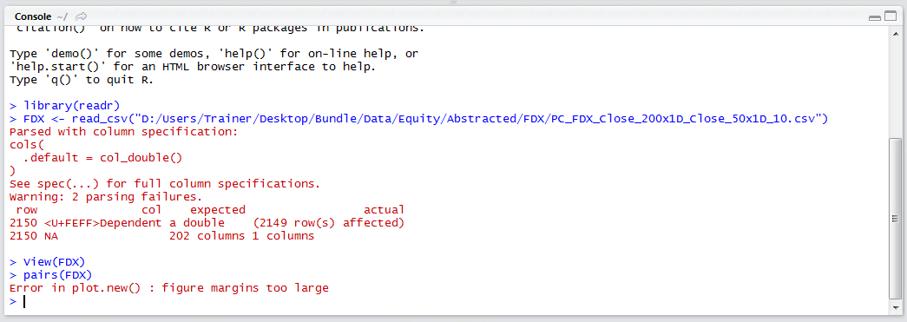
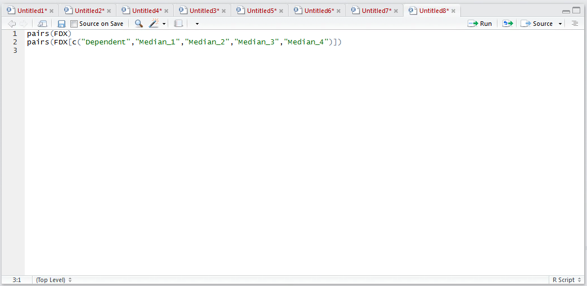
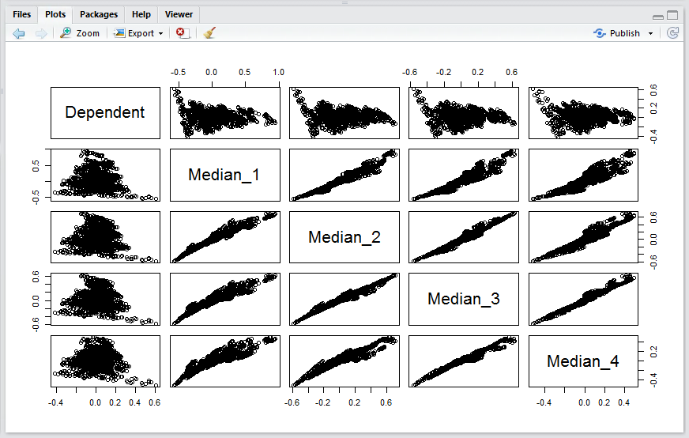

# Procedure 1: Scanning Scatter Plots for Relationships

R has a function called pairs() which is incredibly useful for visualizing the relationships existing between variables inside a data frame on a fairly exhaustive basis.  It is possible to simply pass the data frame as an argument to the pairs function for an exhaustive visualization to be produced:

``` r
pairs(FDX)
```



Run the line of script to console:



In this example, the data frame is far too large, having hundreds of columns, which would create a visualization that is many times larger than the RStudio plots pane.  It follows that more selectivity in the vectors to be used in the visualization need be mustered, a simple matter of subscripting the data frame using square brackets as an argument to the Pairs function:

``` r
pairs[c("Dependent"," Median_1"," Median_1_PearsonCorrelation"," Median_1_ZScore	"," Mode_1"," Mode_1_PearsonCorrelation","Mode_1_ZScore")]
```



Run the line of script to console to produce a matrix of scatter plots:



In this example, the relationship between the dependent variable and the independent variables is most interesting, at a moment's glance it can be seen that several extreme relationships exist.

This process would be repeated, including the dependent variable, for several other groups of independent variables until such time as a familiarity of relationships has been amassed and a good feel for how independent variables relate to the dependent variable has been obtained.  This process can help identify independent variables that correlate well with the dependent variable, carrying these variables forward for the purposes of modeling.