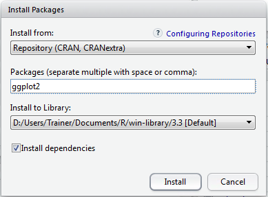
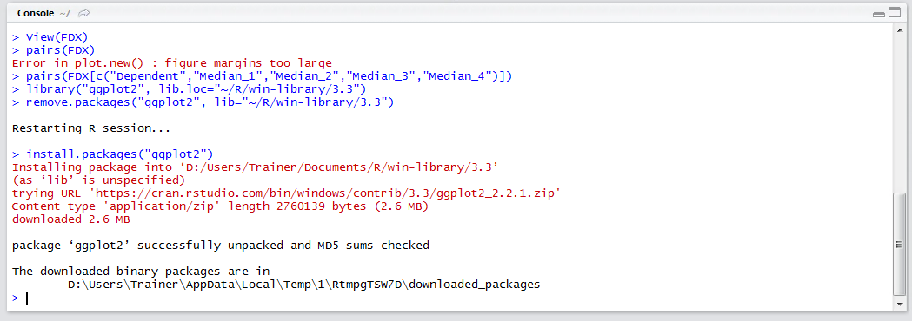
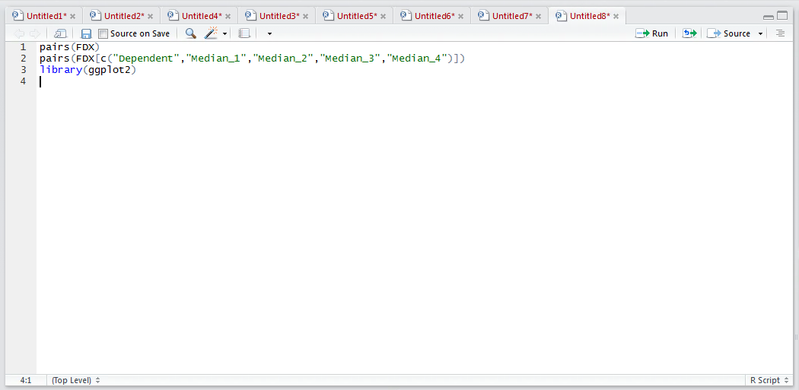
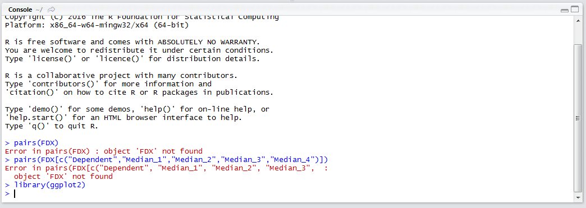
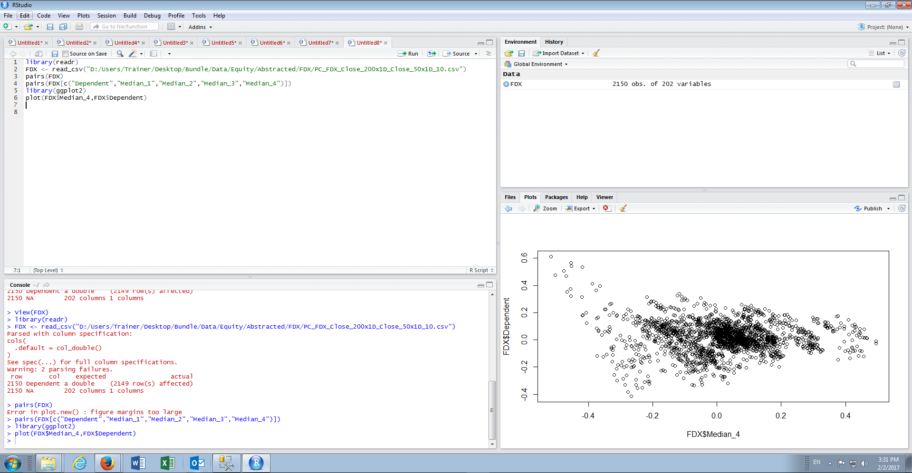
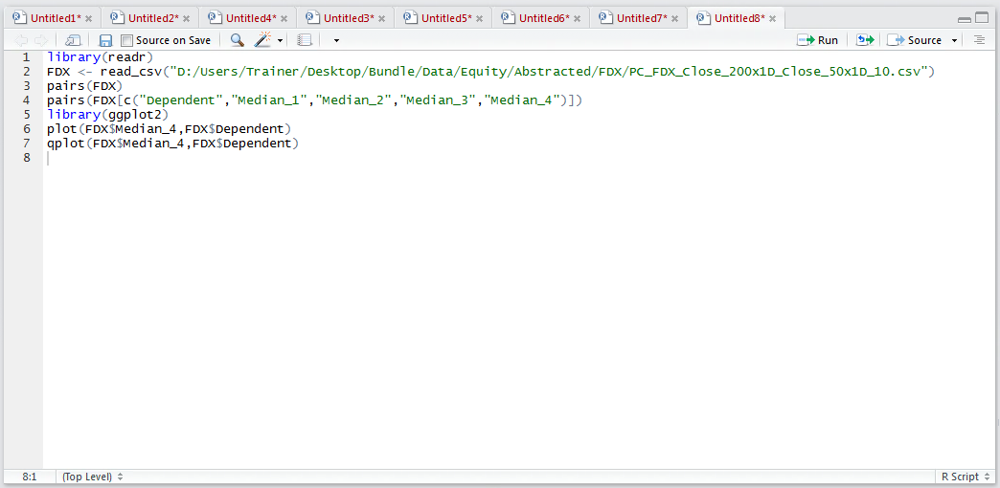
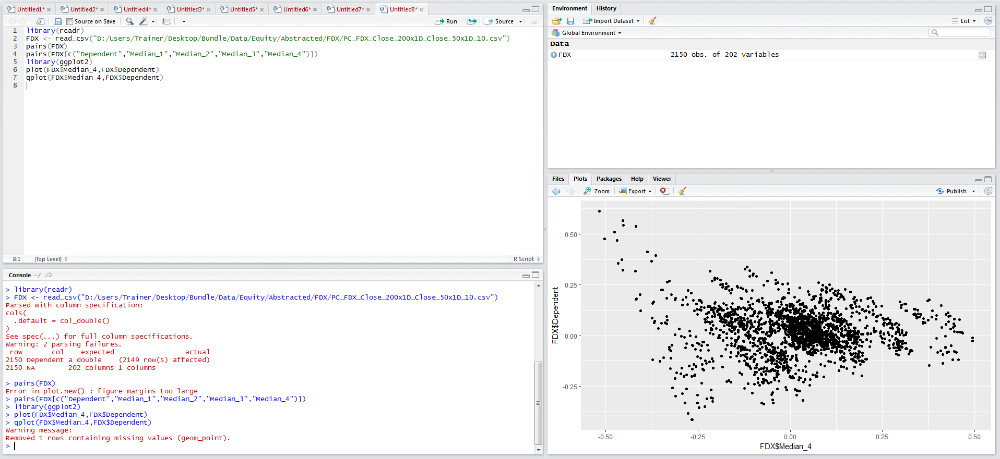

# Procedure 2: Creating a Scatter Plot for Closer Inspection with ggplot2

The scatter plot matrix created in procedure is an extremely useful and informative tool, if lacking beauty.  A package that cannot escape mention for the creation of graphics in R is ggplot2, which is a powerful and flexible graphics package for creating charts and visualisations every bit as beautiful as that which could be found in Excel.  

Start by installing the ggplot package using RStudio:



Clicking install to download and install the package:



Once the packages has been downloaded and installed, reference the package using the library() function and its name ggplot2:

``` r
library(ggplot2)
```



Run the line of script to console:



In this example a scatter plot will be created with the Dependent Vector on the y Axis and the Median_4 on the x axis, and initially using just the built in function plot():

``` r
plot(FDX$Median_4,FDX$Dependent)
```



The signature of the plot() function is effortless and it is a fantastic extensions to perform quick and exploratory data analysis,  although it may not be visually impressive enough for the purposes of presentations.  qplot() is a function in the ggplot2 package and achieves much the same,  just visually more striking:

``` r
qplot(FDX$Median_4,FDX$Dependent)
```



Run the line of script to console:



The package ggplot2 provides a plethora of functions that will create rich and visually impressive graphics, from the being able to manipulate colours to correctly titling a plot with the intention of creating graphics fit for publishing.  

The ggplot functionality will be steadily introduced in subsequent procedures although creating visually striking charts for publication is outside the scope of this course.