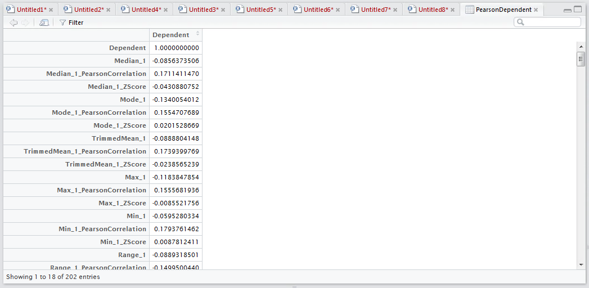

# Procedure 3: Create a Correlation Matrix using Spearman and Pearson

Correlation is a measure of relationship and direction of that relationship.  It is a single value that ranges from -1 to +1, which would signal the direction and strength of a relationship.  Both -1 and +1 are, in their extremes, equally interesting.  A correlation matrix takes all the variables together and produces the correlation value, the strength of their relationship in one director of another, between each variable.

The matrix will be the foundation for many of the techniques used in the following procedures. In R the cor() function is used to produce correlation matrices upon data frames.  To create a Pearson correlation matrix:

``` r
Pearson = cor(FDX,use="complete",method="pearson") 
```


It can be seen that the cor() function takes the FDX data frame as its source.  The method argument specifies which type of correlation calculation to perform, an alternative would be "spearman".

Lastly "use" argument tells the cor() function how to deal with missing or bad data,  whereby the default is to throw an error,  hence it is a good idea to specify "complete" when working with very large datasets else it is likely the entire matrix would be returned as "NA".

Run the line of script to console:


It can be seen that a matrix by the name of Pearson has been created and is available in the environment pane:


Clicking on the entry in the environment pane would expand a view panel and display a more visually satisfying correlation matrix:


As the Pearson correlation is a matrix object, it can be interacted with via subscripting.  While the correlation matrix is extremely useful for identifying collinearity, at this stage the main point of interest is the relationships to the dependent variable only.

To return just the Dependent column:

``` r
PearsonDependent <- Pearson[,"Dependent",drop="false"]
```


In this example the matrix is being subset to bring back all rows by leaving the first argument blank,  while specifying only the "Dependent" column.  By default subsetting will return the simplest structure and it cannot be assumed that it will be the same structure as the original matrix,  hence the drop="false" argument is used to ensure that the structure is the same (this is to say a matrix of rows and columns).

Run the line of script to console:


It can be seen that a new matrix has been created in the environment pane:


Clicking on the new matrix titled PearsonDependent will expand into the script window:



It can be seen that only the first column has been returned making the matrix less foreboding to work with in subsequent procedures.