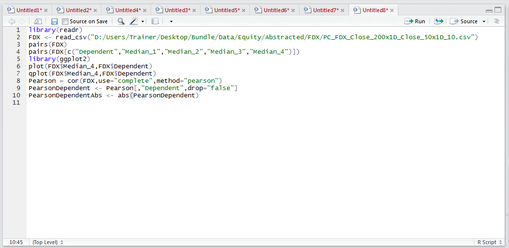
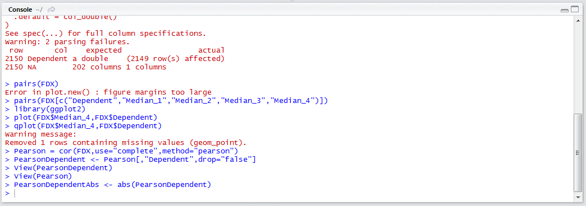
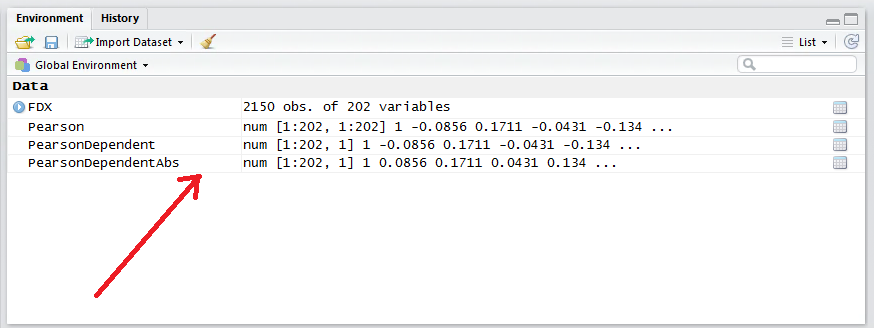
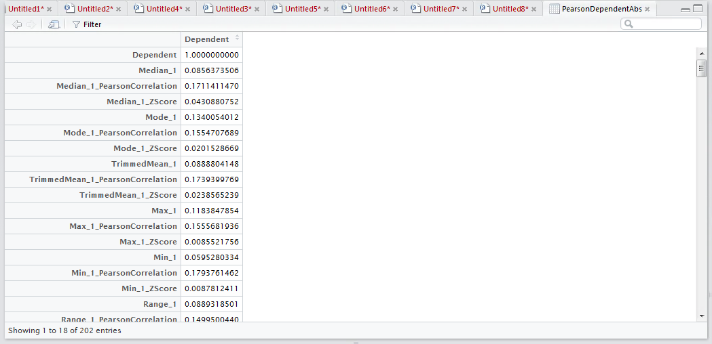
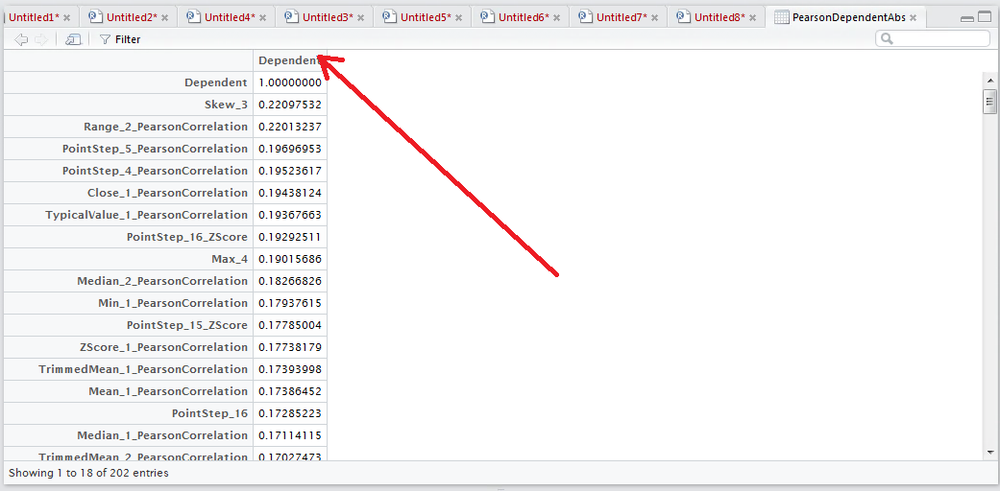

# Procedure 4: Ranking Correlation by Absolute Strength

A correlation matrix was created and the first column was transposed into a matrix by the name PearsonCorrelation.  The PearsonCorrelation matrix has the strength of relationship between each of the independent variables and the dependent variables.
The first task is to order the variables by their strength of their ABSOLUTE correlation, as both -1 and +1 are equally interesting extremes.  The abs() function in R makes this transformation effortless:

``` r
PearsonDependentAbs <- abs(PearsonDependent)
```



Run the line of script to console:



It can be seen from the environment pane window that a new matrix has been created:



In this instance, any negative number has been turned into a positive number, as observed by a single click in the environment pane:



The task remains to order the matrix by highest value to the lowest value.  This can be achieved with a simple click on the column in the matrix viewer (click once for ascending, again for descending):



While there are methods to order a matrix in R, they are extremely convoluted and the arrange() function as presented in procedure 50 does not work,  as the matrix is not a data frame.

In view of this process being exploratory and not necessarily needing to be recreated, the manual ordering in the view pane is adequate.