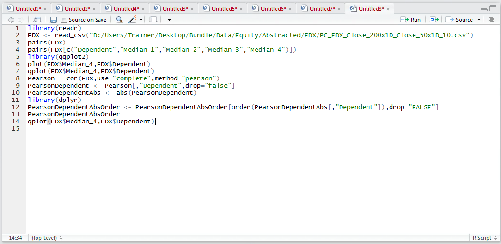
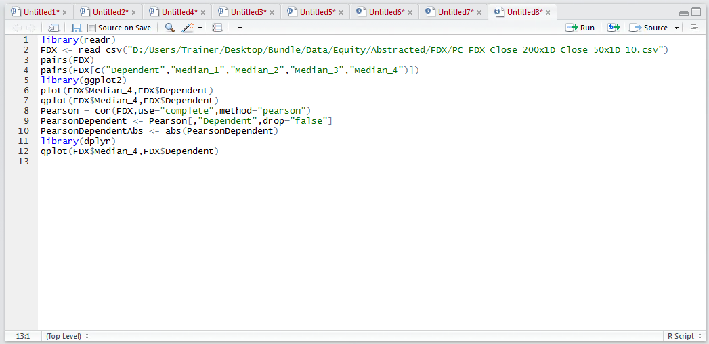
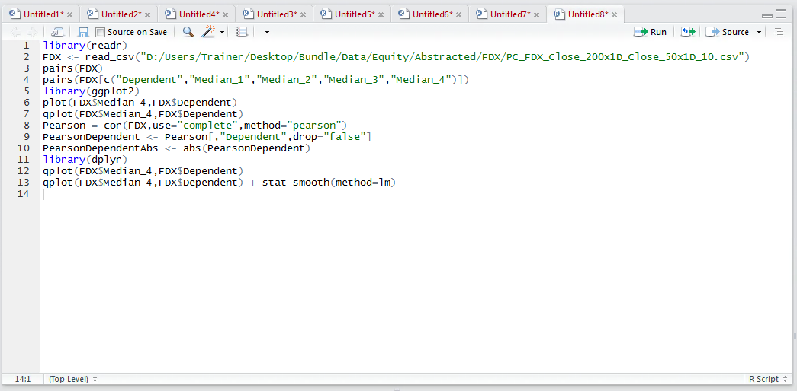
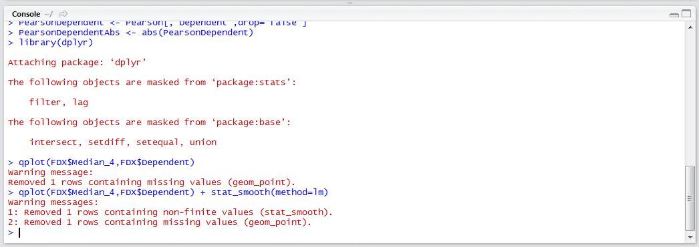
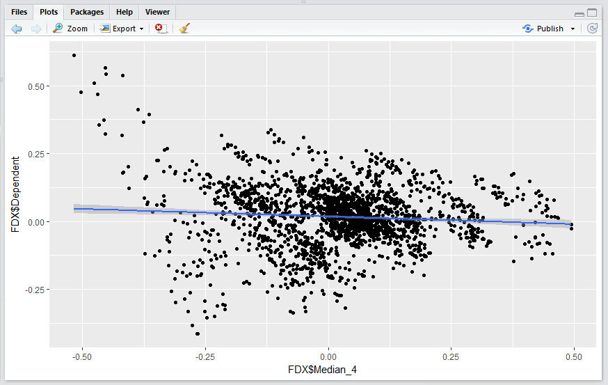

# Procedure 5: Adding a Trend Line to a Scatter Plot

A scatter plot comparing the dependent variable and the independent variable was created of Median_4.  In the scatter plot, there was, just about, a relationship identified.  To better visualise this relationship a trend line can be added based on a line of best fit through the points on the scatter plot.

To create the scatter plot using ggplot2 and the qplot() function:



Run the line of script to console:



The actual formula for linear regression, as created by the lm() function is to be explained in more depth in subsequent procedures,  however for the moment the lm() function is going to specified as the method of the stat_smooth() method of ggplot2:

``` r
qplot(FDX$Median_4,FDX$Dependent)
```



Run the line of script to console:



It can be seen that a plot has been created as in procedure 85, yet this time with a trend line representing a linear regression model:



It can be seen that there is a very shallow downward trend and this linear regression solution has some predictive power, albeit very weak in isolation (hence the importance of multiple linear regression as specified in procedure 93).