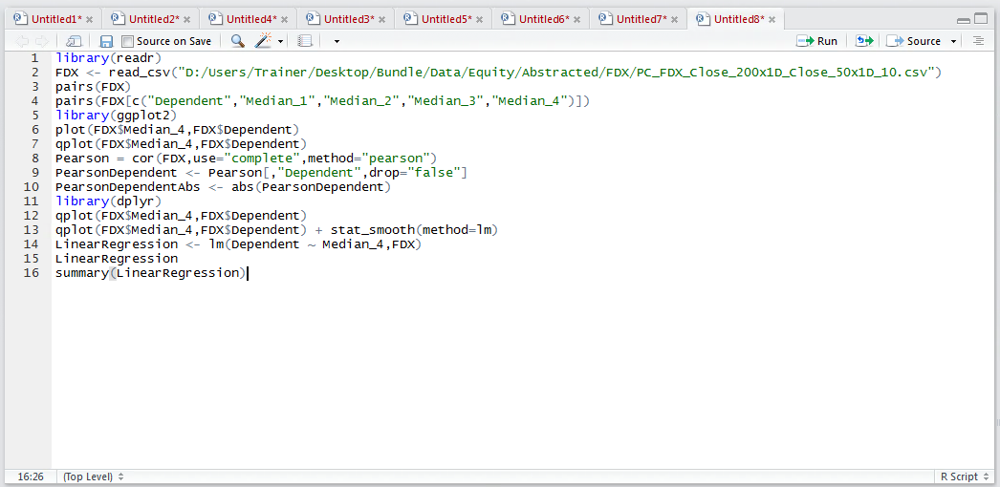

# Procedure 6: Creating a One Way Linear Regression Model

In procedure 88 the lm() function was used inside the stat_smooth() function of ggplo2 to create a linear regression solution,  rather line of best fit. Naturally the lm() function can also be used to create linear regression model which can be deployed as a predictive model in its own right.

To create a linear regression model with one dependent variable and one independent variable:

``` r
LinearRegression <- lm(Dependent ~ Median_4,FDX)
```


Run the line of script to console:


Once the model has been computed it can be output:

LinearRegression


Run the line of script to console:


The most vital aspects of the solution are written out chiefly the Intercept and Coefficient for Median_4.  Notably there is no statistical measures to appraise the overall worth of the solution.

The summary() function can be used to expand on the validity and performance of the model:

``` r
summary(LinearRegression)
```



Run the line of script to console:


A more traditional Linear Regression model has now been written out.   It is worth checking the precision of the coefficients to ensure that they have not been truncated, as this can lead to a profound change in the predicted values:

``` r
coeefeicents(LinearRegression)
```


Run the line of script to console:


It can be seen that the coefficients written out have rather more decimal places, or precision, which will be extremely important when seeking to make accurate predictions.