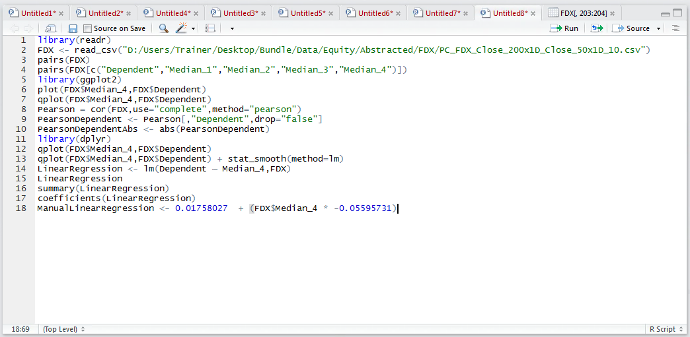
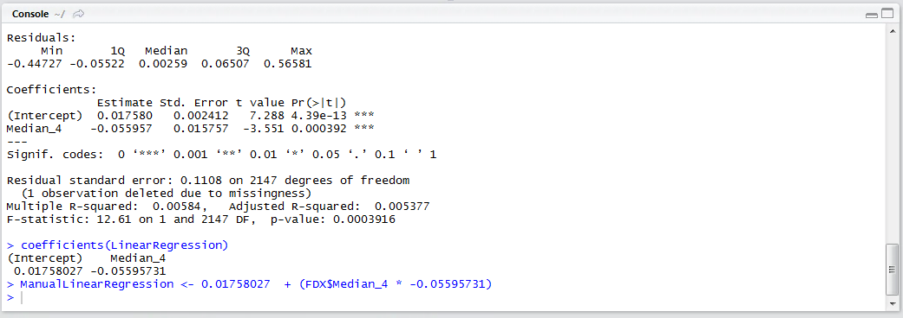
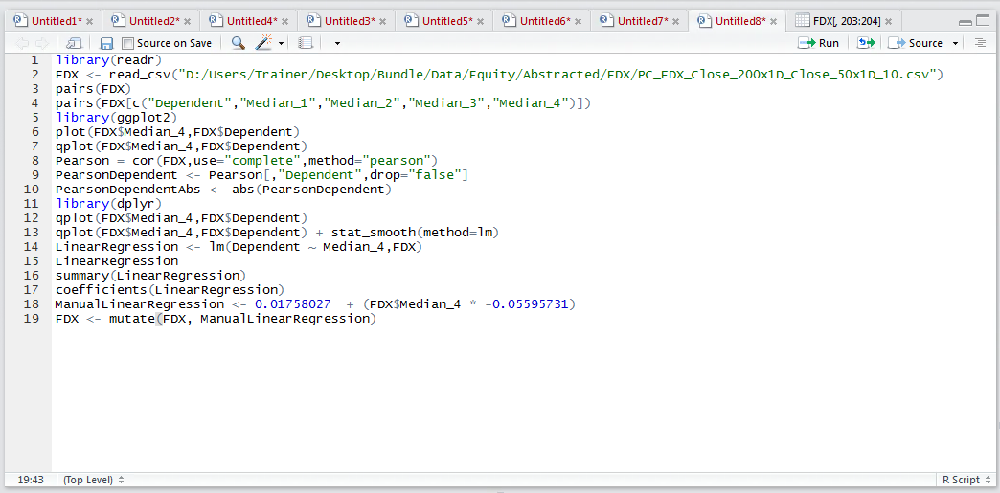
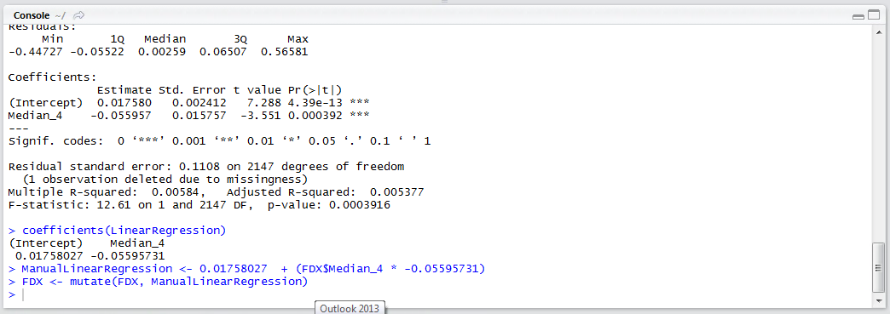
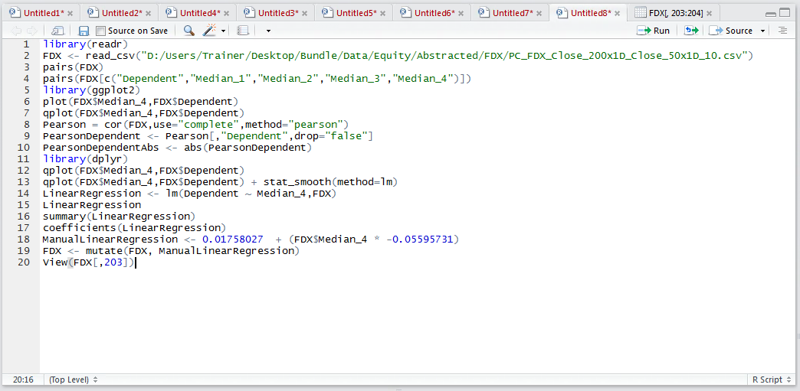
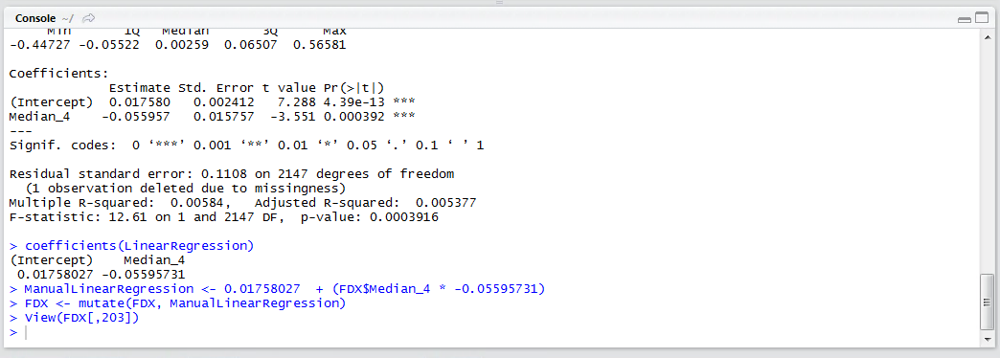
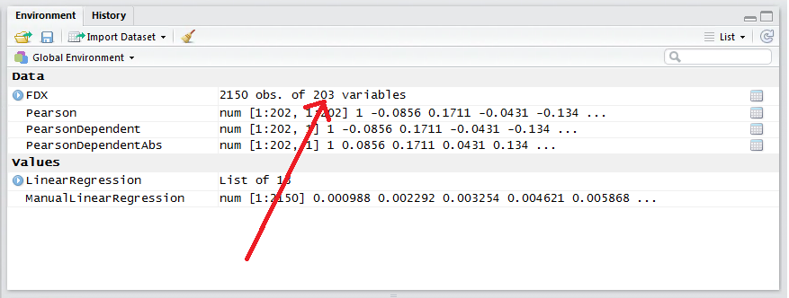
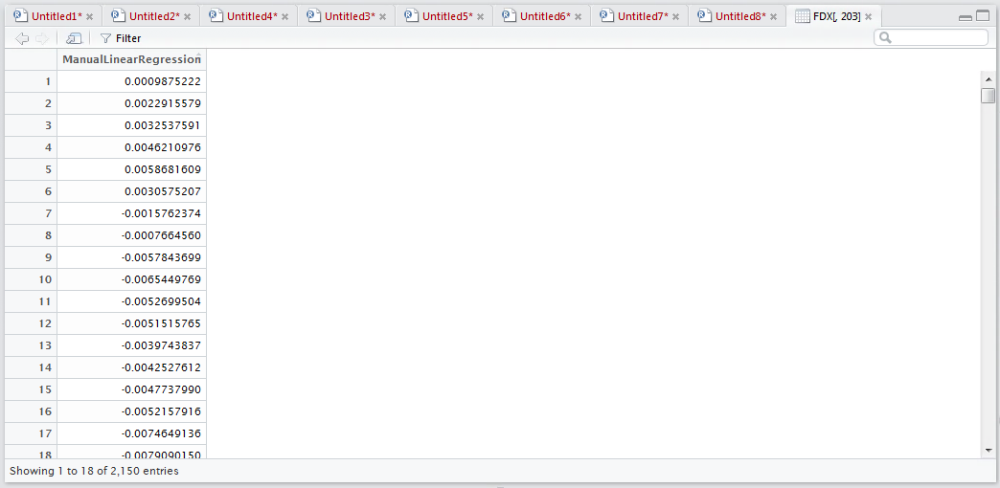

# Procedure 7: Deploying a One Way Linear Regression Manually with vector arithmetic

The deployment formula for a linear regression model is quite straightforward and is simply a matter of taking the intercept then adding, in this example, the Median_4 value multiplied by the coefficient:

``` r
ManualLinearRegression <- 0.01758027 + (FDX$Median_4 * -0.05595731)
```



Run the line of script to console:



As vector arithmetic, has been performed, the formula has been applied to every row of the data frame.  To add this vector to the FDX data frame, procedure 53 would be executed in a similar fashion:

``` r
FDX <- mutate(FDX, ManualLinearRegression)
```



Run the line of script to console:



The mutate() function appends the vector to the FDX data frame.  To verify the column has been appended, view the FDX data frame:

``` r
View(FDX[,203])
```



Run the line of script to console:



The use of subsetting in the call to the View() function is far less than ideal and it is to compensate for the inability of RStudio to display more than 100 columns in the grid.  In this example, prior to calling the mutate() function there were 202 columns,  after which there were 203:



The call to the View() function in this manner yields evidence that column has been successfully added:

