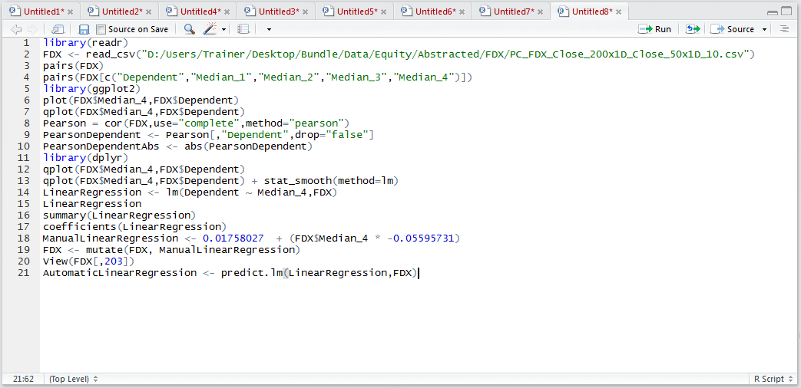
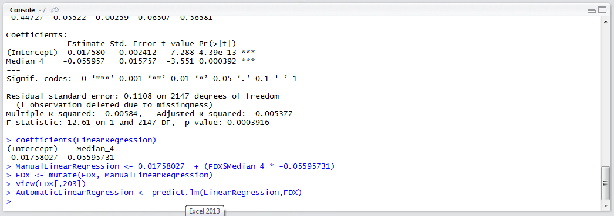
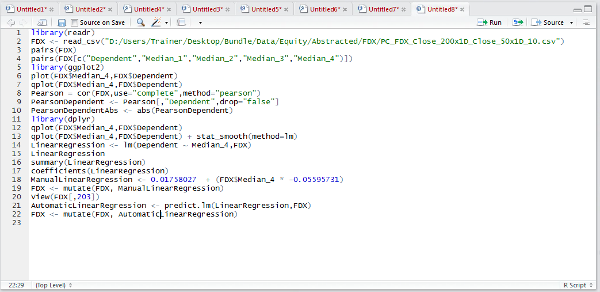
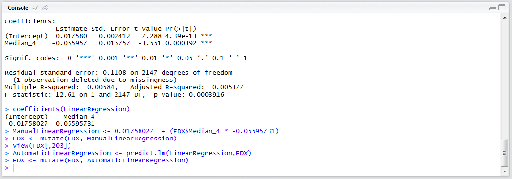
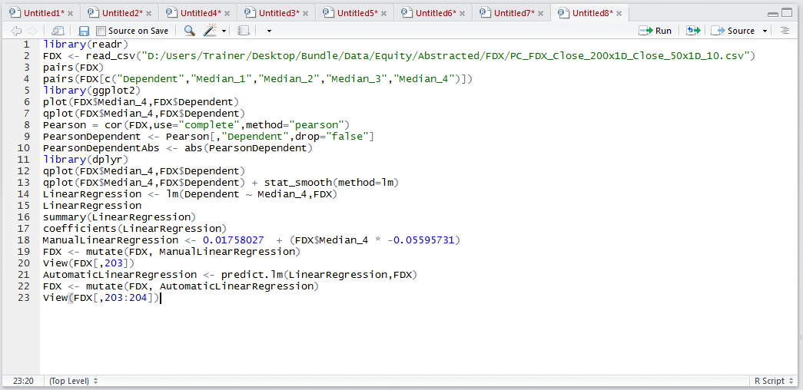
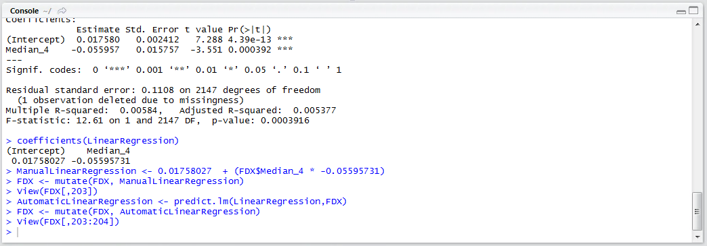
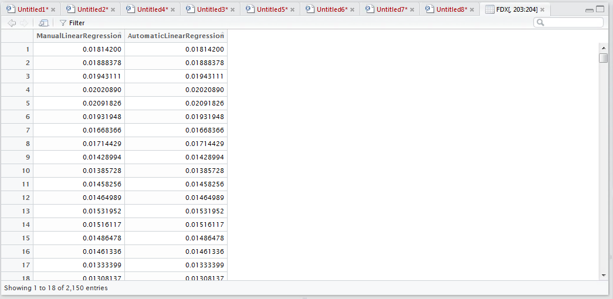

# Procedure 8: Using the predict function for a one way linear regression one

Deploying a linear regression model manually is rather simple, however, there is an even simpler method available in calling the predict() function which takes a model and a data frame as its parameter,  returning a prediction vector.

``` r
AutomaticLinearRegression <- predict.lm(LinearRegression,FDX)
```



Run the line of script to console:



Add the newly created vector to the FDX data frame:

``` r
FDX <- mutate(FDX, AutomaticlLinearRegression)
```



Run the line of script to console:



To view the last two columns of the data frame, containing a manually derived prediction and automatically derived prediction:

``` r
View(FDX[,203:204])
```



Run the line of script to console:



The manual and automatic prediction shown side by side are identical to each other.  It follows that the automatic prediction is a much more concise means to execute the prediction based upon a linear regression model created in R:

