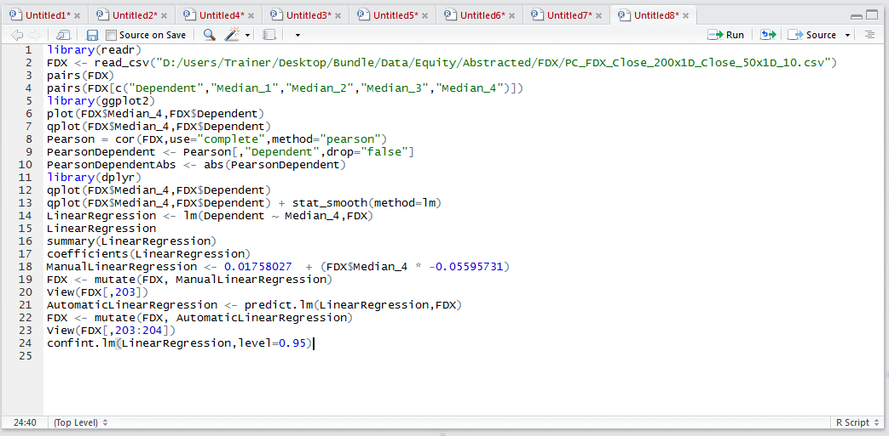
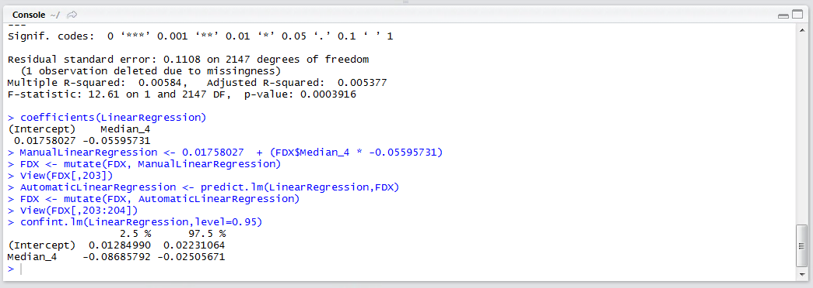

# Procedure 9: Identifying Confidence Intervals

The confidence intervals can the thought of as the boundaries for which the coefficient, for a given independent variable, can be moved up and down while still maintaining statistical confidence.  Unusually for regression software, the confidence intervals are not written out by default, and they need to be called by passing the linear regression model to the confint() function:

``` r
confint.lm(LinearRegression,level=0.95)
```



Run the line of script to console:



The confidence intervals for each of the values required to construct the linear regression formula have been written out.