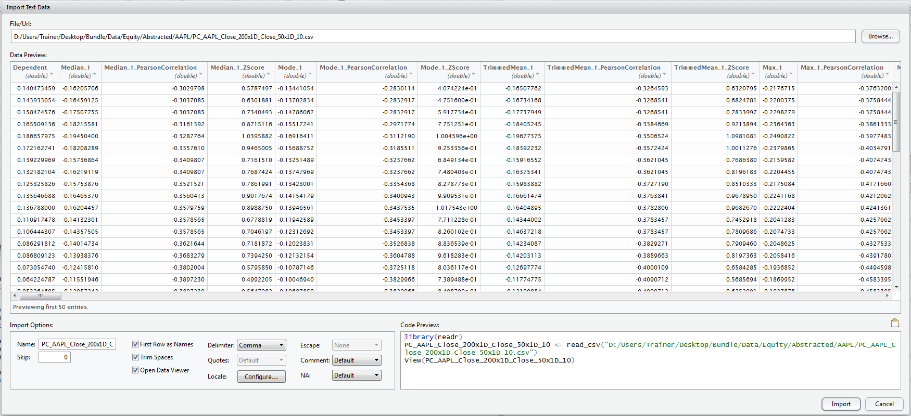
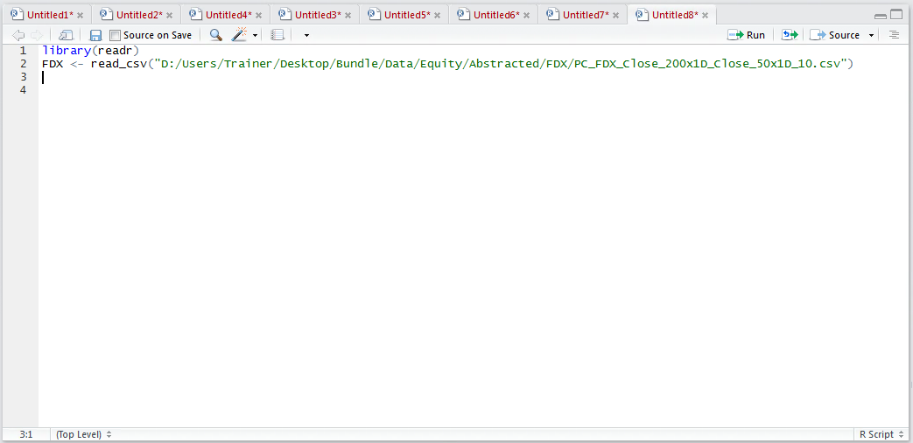
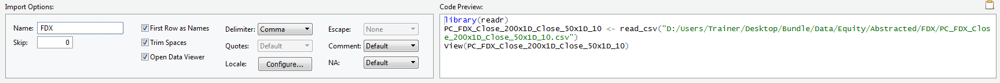
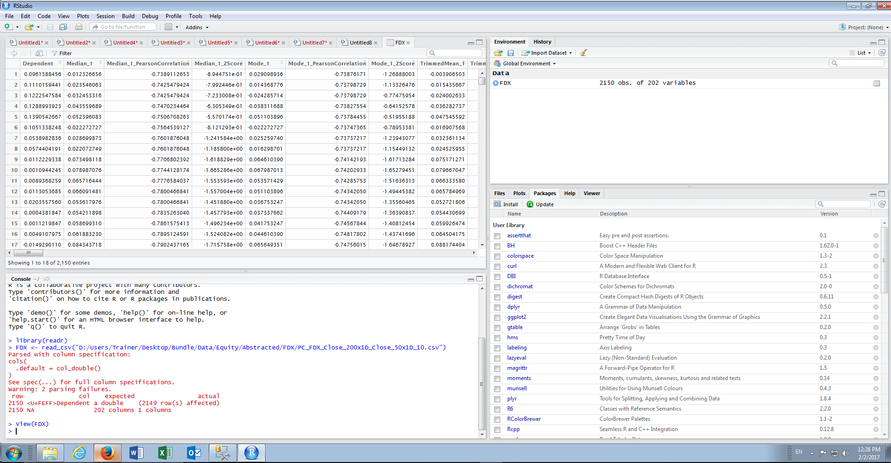

# Module 8: Linear Regression

Linear Regression is a modelling technique that can be used for numeric prediction where the values are fairly normal in distribution.

The dataset that is used in this module is available under Bundle\Data\Equity\Abstracted\FDX\PC_FDX_Close_200x1D_Close_50x1D_10.csv which contains data that has already been abstracted for the FedEx stock on the NYSE.

To proceed with the subsequent procedures, it is necessary to import the file PC_FDX_Close_200x1D_Close_50x1D_10.csv into R:

For completeness the library(readr) and Load_CSV() function text will be copied to the current script to ensure that the script remains portable:

For ease and simplicity the name of the data set has been changed to FDX from the default of PC_FDX_Close_200x1D_Close_50x1D_10.csv:

Executing the load, the contents of the csv file will automatically be exposed on invoking the view() function in the console:

