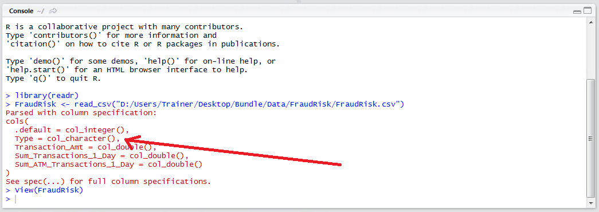
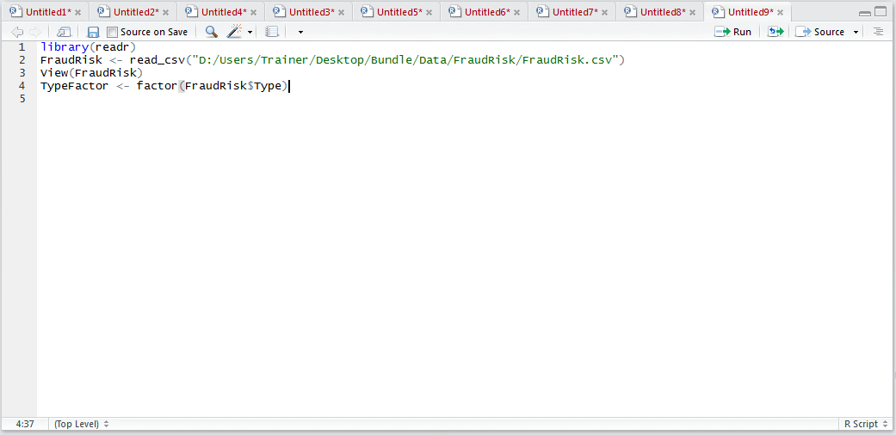
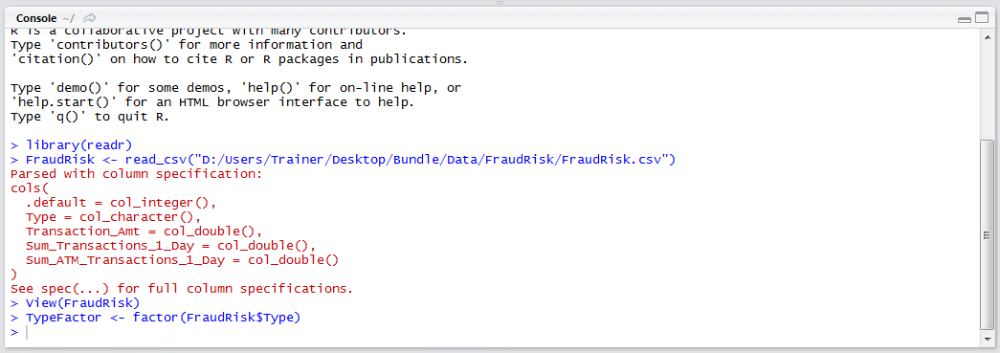
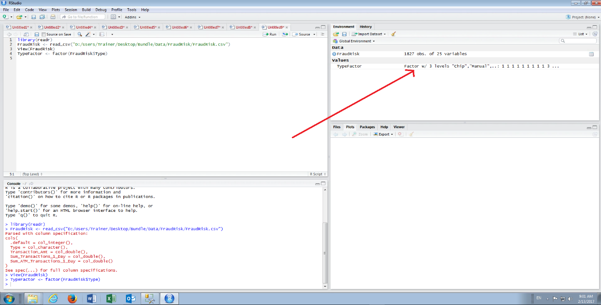
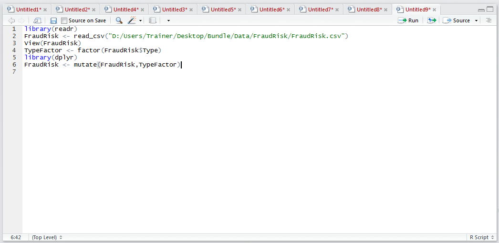
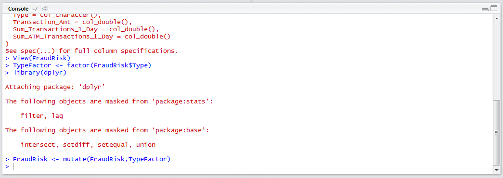
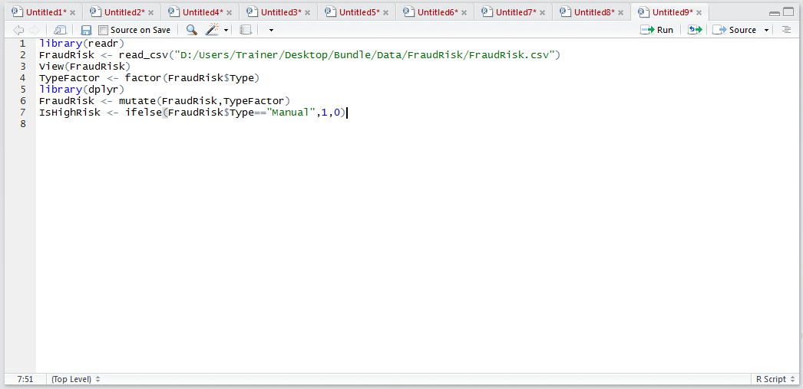
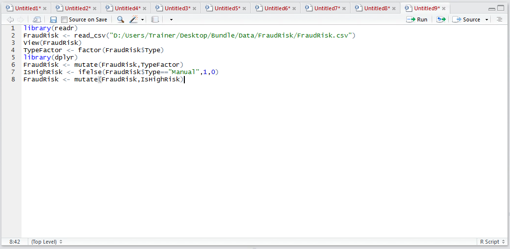
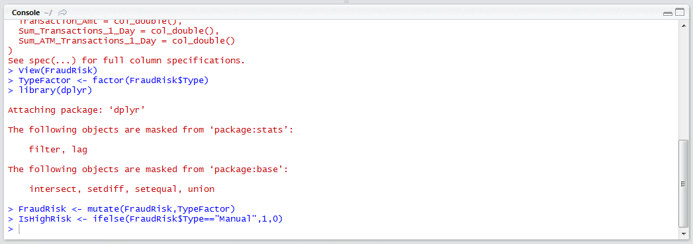

# Procedure 1: Pivot a Categorical Variable for Regression Analysis

In behavioural analytics and classification, character data and numeric label data (that which has a numeric label, but obeys no standard distribution) appear quite often.  It is necessary to pre-process such label data, pivoting the distinct values to their own columns, representing either a 1 or a 0, for example the transaction in this instance was either made on a Chip card (i.e. 1) or it was not (i.e. 0).

For dealing with categorical variables, and as a labour-saving tactic to avoid having to perform categorical data pivoting on each and every distinct entry in a vector, the factor functionality can be invoked and as introduced in procedure 32.

It can be seen that the data was imported with the type field taking the form of a character field:



Start by creating a factor which will implicitly convert the contents of the Type column to the factor:



Run the line of script to console:



It can be seen that the factor has been created and appears in the environment pane:



All that remain is to append the newly created to factor to the FraudRisk data frame to that it can be used in subsequent analysis as procedure 52:

``` r
libarary(dplyr)
FraudRisk <- mutate(FraudRisk,TypeFactor)
```



Run the block of script to console:



While R has a convenient data structure in the form of factors, it may well be appropriate to manually pivot data to a vector based on rudimentary if logic and \ or as part of horizontal abstraction.   In this example, a vectorised comparison will be performed using the ifelse() function which will determine if a value in the Type field is equal to "Manual", in which case a the value 1 will be returned to the new vector,  else 0:

``` r
IsHighRisk <- ifelse(FraudRisk$Type=="Manual",1,0)
```



Run the line of script to console:


Append the newly created vector to the FraudRisk data frame:



Run the line of script to console:

