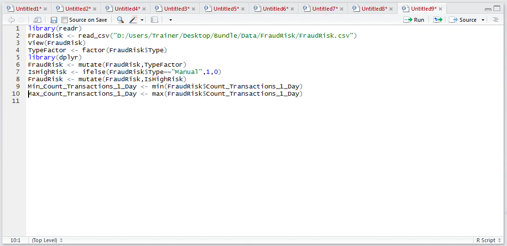
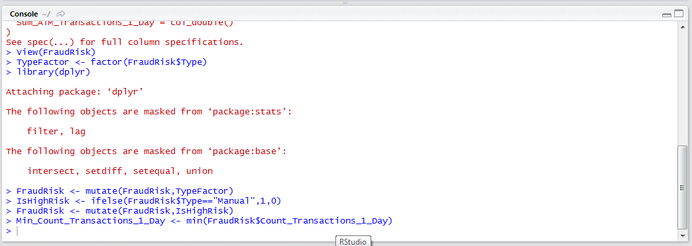
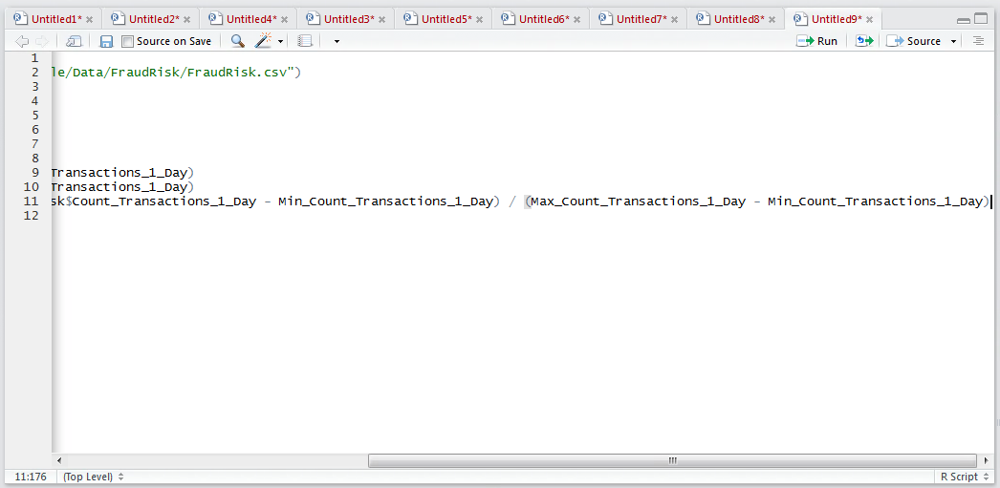
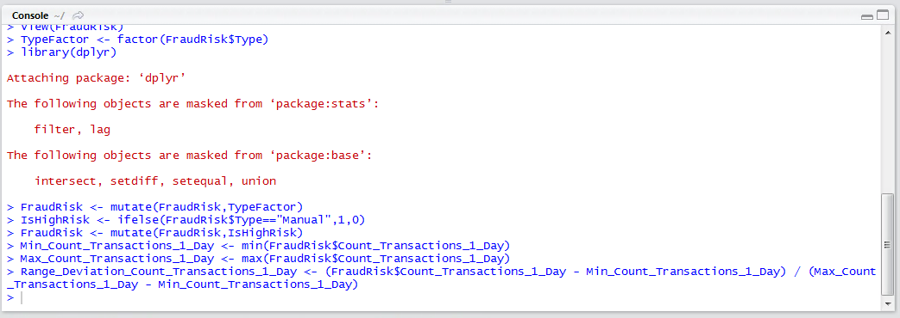
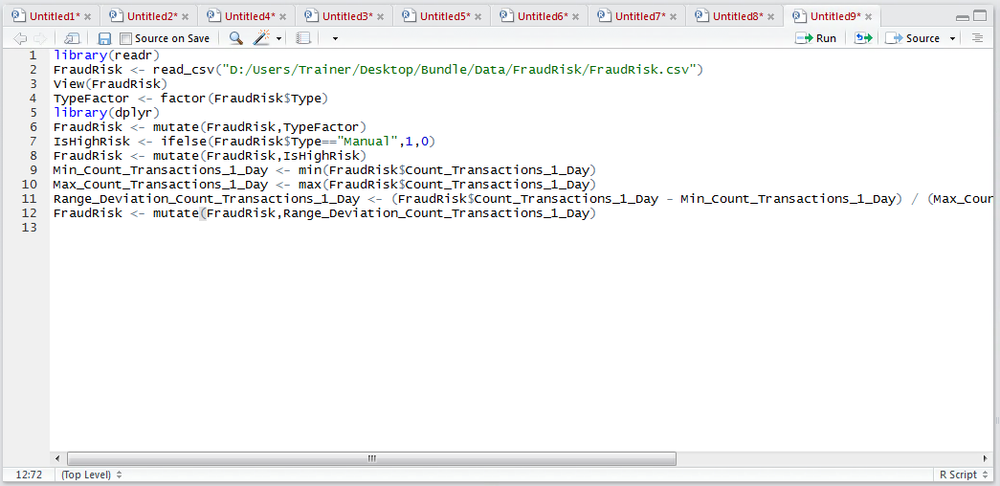
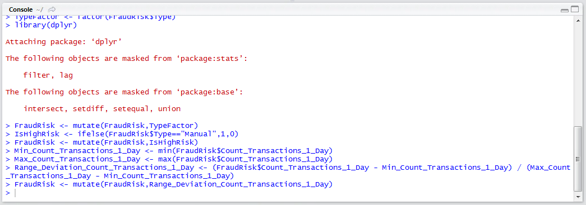

# Procedure 2: Create an Abstraction Deviation Independent Vector

In behavioural analytics, especially, one of the most powerful improvements that can be made to a variable is a transformation to compare the value for that records against the value typically observed in this vector for a customer \ product \ portfolio.  There are of course several normalisations that are appropriate for such a task, such as a Z score, however in this instance given the data being skewed a range normalisation may be more appropriate.

A range normalisation will establish the largest value observed in the vector, the smallest value and establish where a test value exists on that range in percentage terms.  In this example, a range normalisation will be performed on the columns Count_Transactions_1_Day.  Firstly, establish the maximum and minimum values:

``` r
Min_Count_Transactions_1_Day <- min(FraudRisk$Count_Transactions_1_Day)
Max_Count_Transactions_1_Day <- max(FraudRisk$Count_Transactions_1_Day)
```



Run the block of script to console:



At this stage, the minimum and maximum values have been stored as vectors for Count_Transactions_1_Day.  To create a new vector as a range normalisation:

``` r
Range_Deviation_Count_Transactions_1_Day <- (FraudRisk$Count_Transactions_1_Day - Min_Count_Transactions_1_Day) / (Max_Count_Transactions_1_Day - Min_Count_Transactions_1_Day)
```



Run the line of script to console:



Append the newly created vector to the FraudRisk data frame:

``` r
FraudRisk <- mutate(FraudRisk, Range_Deviation_Count_Transactions_1_Day)
```



Run the line of script to console:

