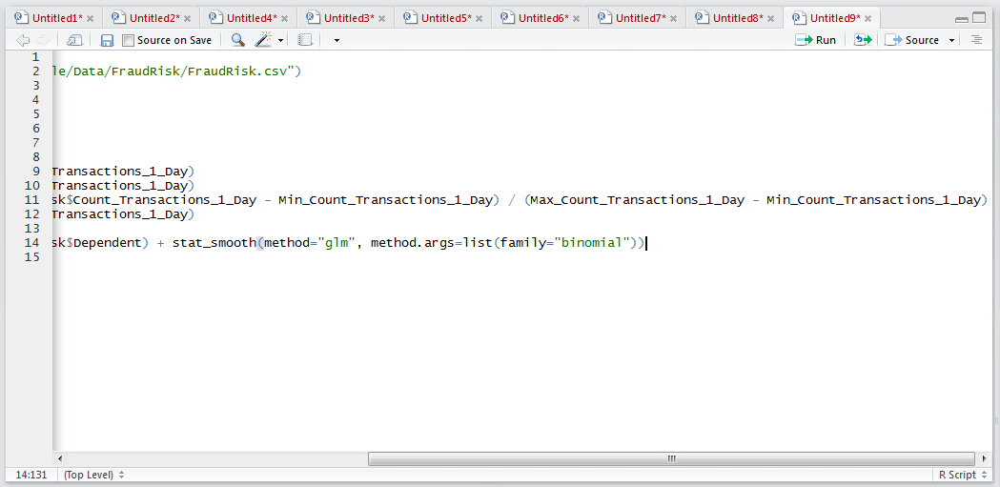
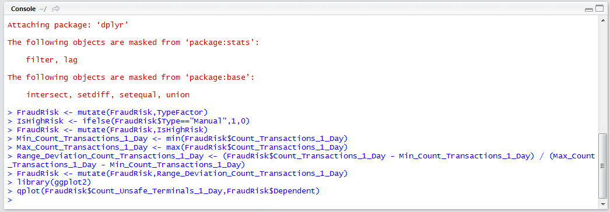
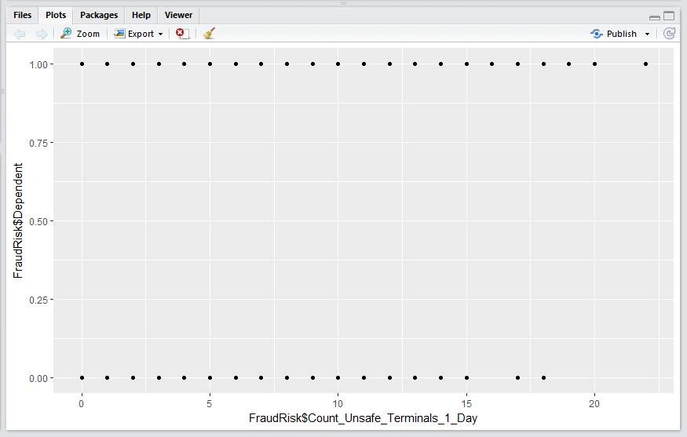
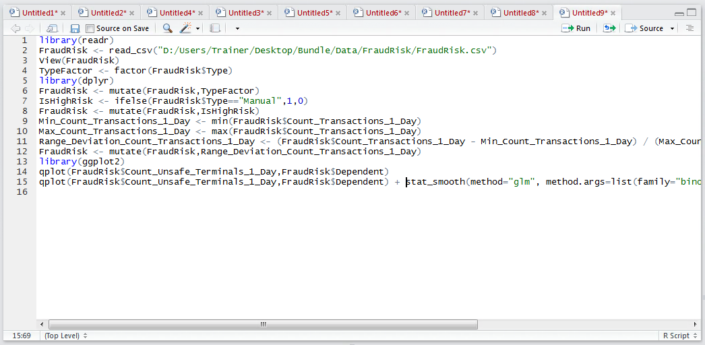
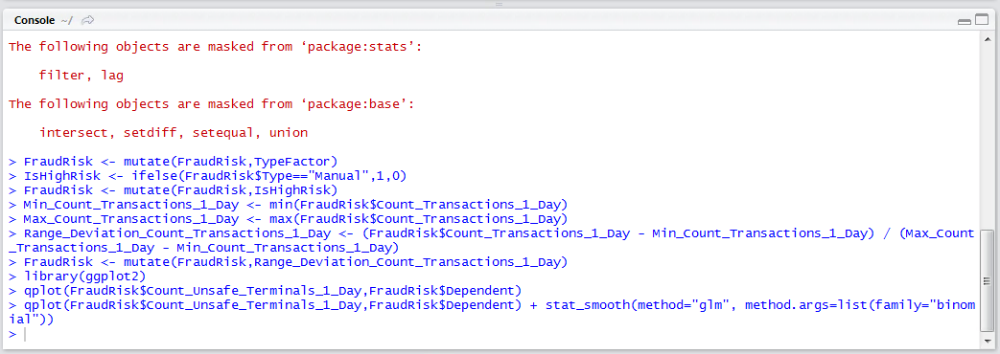

# Procedure 3: Fit a one-way Log Curve on a Plot

As in procedure 88 where a relationship between two variables was appraised using a linear regression, rather ordinary least squares estimation, a similar method exists in R for appraising the extent to which two variables fit a log curve.  Start by plotting the dependent variable, fraud, with the independent variable Count_Transactions_1_Day as procedure 85:

``` r
library(ggplot2)
qplot(FraudRisk$Count_Unsafe_Terminals_1_Day,FraudRisk$Dependent) 
```



Run the block of script to console:



It can be seen that a plot has been created between the variable Count_Unsafe_Terminals_1_Day and the Dependent variable, and on the basis, that the fraud can either be or not, it has plotted nothing between the points on the Y axis:



To estimate an appropriate logistic regression curve through the points use the glm function of the statsmooth() function:

``` r
qplot(FraudRisk$Count_Unsafe_Terminals_1_Day,FraudRisk$Dependent) + stat_smooth(method="glm", method.args=list(family="binomial"))
```



Run the line of script to console to create the plot with a fitted logistic curve:



It can be observed that there is a defined log curve that would suggest that the more and more unsafe terminals a customer uses, the more and more certain it becomes that the account may be subject to fraud.  It follows that it can be assumed that this value will have some validity for logistic regression modelling.