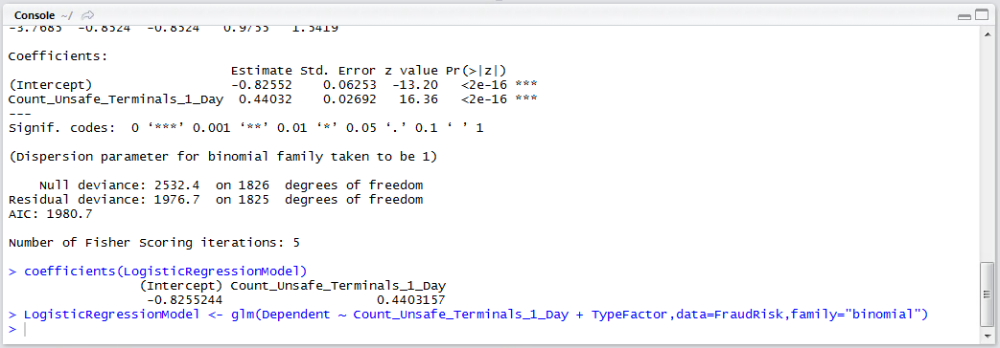

# Procedure 4: Forward Stepwise Logistic Regression

As procedure 97 alludes, whereas the linear regression function in R was lm(), the logistic regression function is glm(), with supplementary parameters specifying the family as being a binomial distribution (which is a stalwart distribution for classification problems).  As in procedure 89 which create a linear regression model, the syntax is very similar to create a logistic regression model, albeit including the family argument:

``` r
LogisticRegressionModel <- glm(Dependent ~ Count_Unsafe_Terminals_1_Day,data=FraudRisk,family="binomial")
```


Run the line of script to console:


As with a lm() type model, the summary() function can return the model output:

``` r
summary(LogisticRegressionModel)
```


Run the line of script to console:


As with models created using the lm() function, the summary is somewhat inadequate to get the coefficients with correct precision, notwithstanding that the predict.glm() function will be used for recall:

``` r
coefficients(LogisticRegressionModel)
```


Run the line of script to console to output the coefficients for a manual deployment of the logistic regression model:


This procedure would naturally lead into a stepwise multiple logistic regression model, and in this example a factor as created in preceding procedures will be added with the assumption that it is the next strongest correlating factor:


Run the line of script to console:



Write out the coefficients to observe the treatment of each different state inside the factor TypeFactor:

