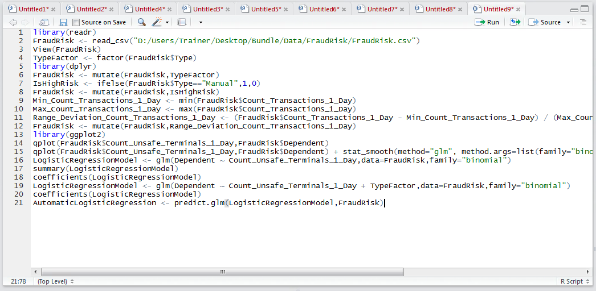
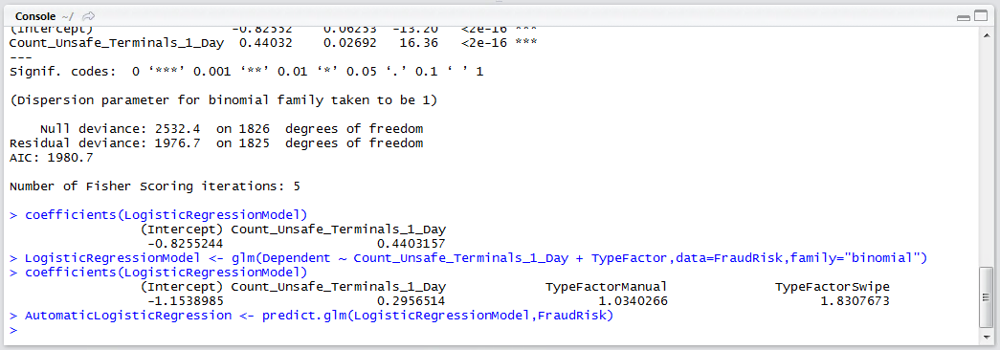
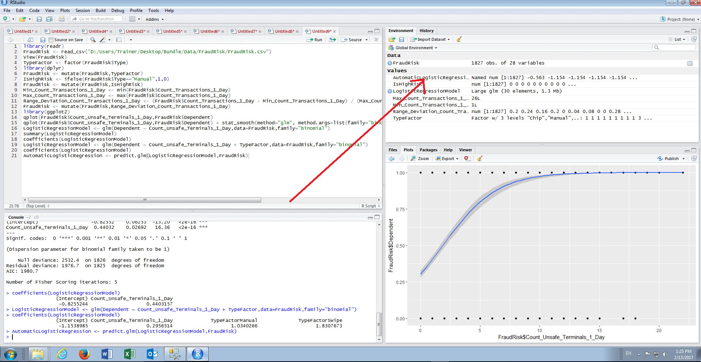
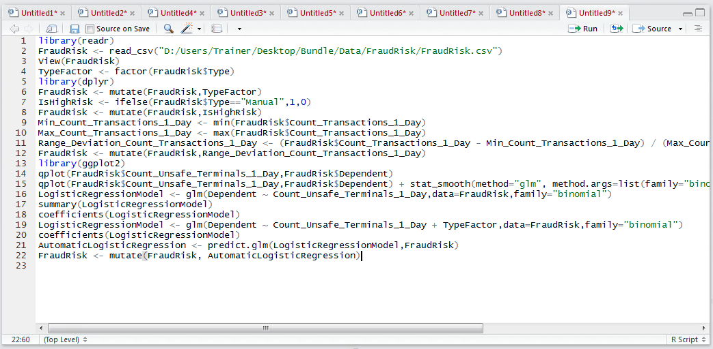
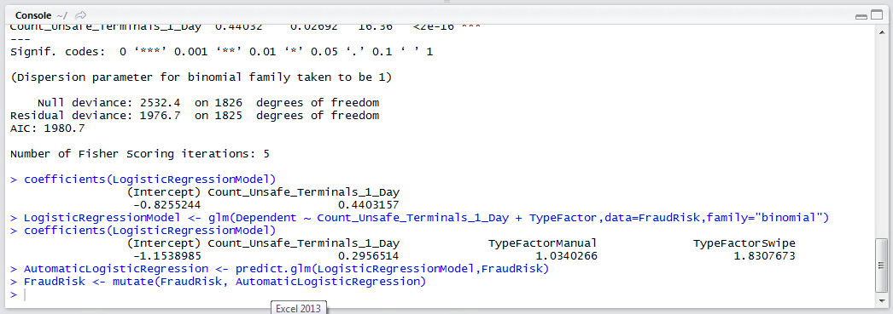

# Procedure 5: Recalling a Logistic Regression Model

It is fairly self-explanatory to deploy a logistic model, recall is performed in the same manner as a linear regression model.  As with the lm() product, the glm() model has a predict.gml() function to create a prediction for all values in a data frame.  The signature bears stark resemblance to that of the predict.lm() function:

``` r
AutomaticLogisticRegression <- predict.glm(LogisticRegressionModel,FraudRisk)
```



Run the line of script to console:



It can be seen that a new vector has been created in the environment pane which will contain the predictions for each entry in the FraudRisk Data Frame:



For completeness, merge the newly created vector into the FraudRisk data frame:

``` r
FraudRisk <- mutate(FraudRisk, AutomaticLogisticRegression)
```



Run the line of script to console:

