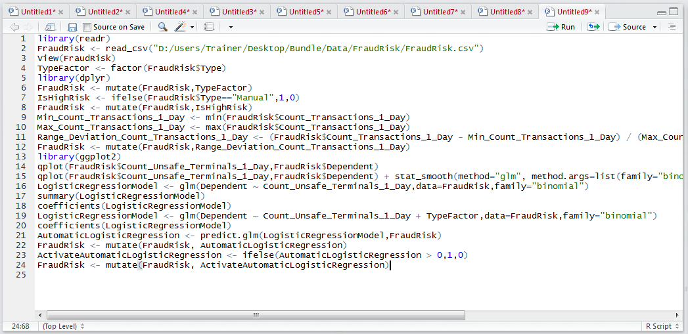

# Procedure 6: Activating Logistic Regression and Creating a Confusion Matrix

A logistic regression model outputs values between – 5 and +5, representing zero probability to 100% percent probability.  Zero would represent a 50/50 probability, anything greater than zero would denote the outcome being more likely than not.

In this example, suppose that activation is to take place based upon the balance of probabilities and anything greater than 0 should be considered as being predicted, in this example, as fraud.  The ifelse() function can facilitate the creation of an activation function:

``` r
ActivateAutomaticLogisticRegression <- ifelse(AutomaticLogisticRegression > 0,1,0)
```


Run the line of script to console:


For completeness merge the Activated Logistic Regression model into the fraud risk data frame:

``` r
FraudRisk <- mutate(FraudRisk, ActivateAutomaticLogisticRegression)
```



Run the line of script to console:


Run the line of script to console to output the confusion matrix:


In this example, it can be seen that of 901 records in total, 576 were judged to be fraudulent by the model and were in fraudulent in actuality, some 63.9% a figure for which improvement should be sought via stepwise logistic regression.  

The process of calculating the performance of the confusion matrix in this manner is quite laborious and there exist several packages that help layout the confusion matrix with more readily available performance measures.  Install the gmodels package:


Click install to both download and install:


Once the gmodels library is installed it needs to be referenced.  To create the confusion matrix, the line of script resembles the table() function almost absolutely, except making use of the CrossTable() function of the gmodels package:

``` r
library("gmodels")
CrossTable(FraudRisk$Dependent, FraudRisk$ActivateAutomaticLogisticRegression)
```


Run the line of script to console:


It can be seen that a confusion matrix has been created in much the same manner except for it has created the summary statistics across both axis of the table.