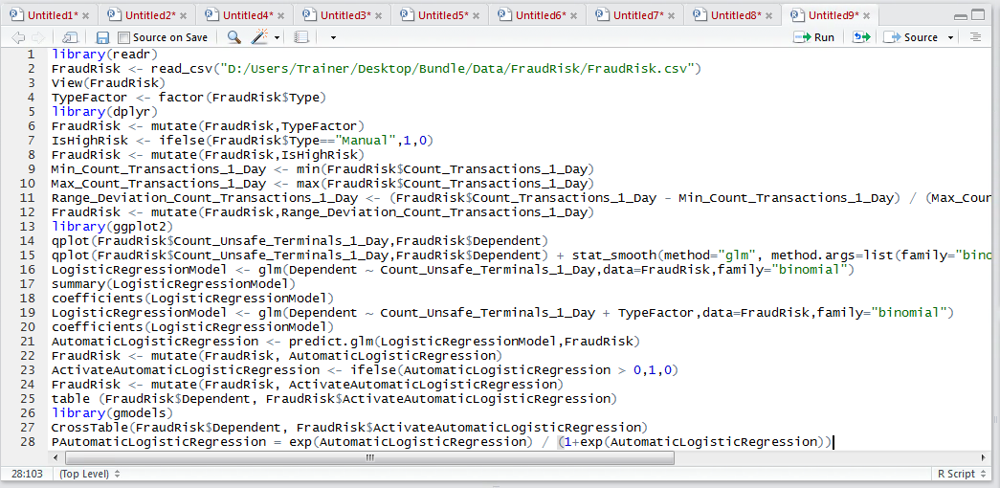
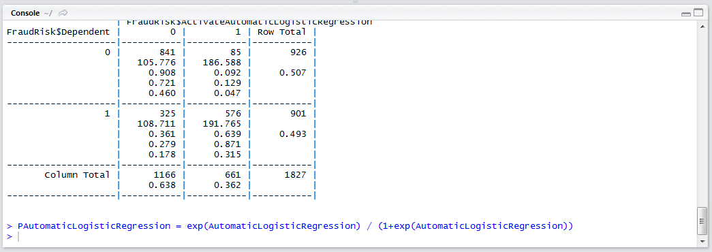
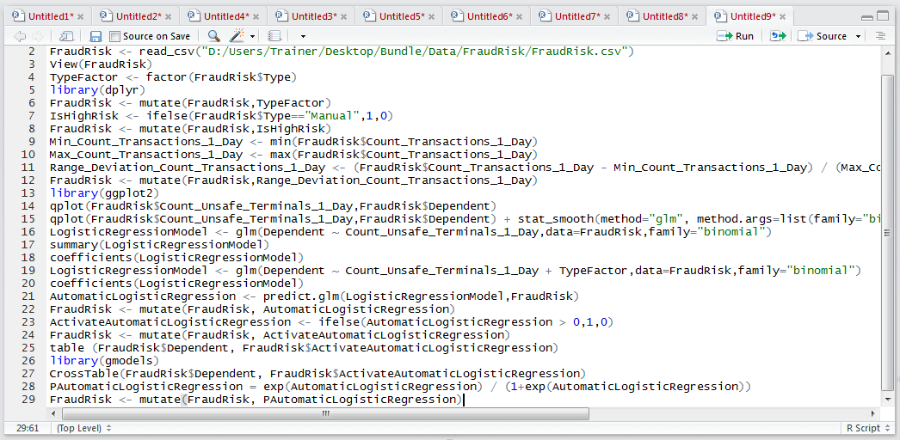
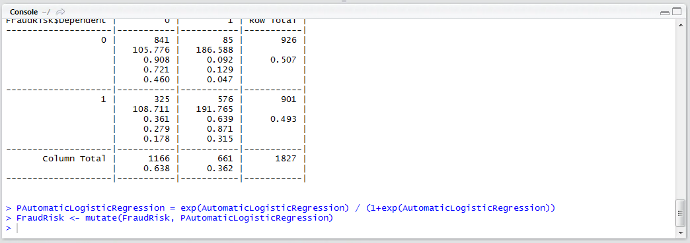

# Procedure 7: Output Logistic Regression Model as Probability

The logistic regression output ranges from –5 to +5, yet oftentimes it is substantially more intuitive to present this output as a probability.  The formula to convert a logistic regression output to a probability is:

``` r
P = exp(Ouput) / (1+exp(Ouput))
```

It follows that vector arithmetic can be used, simply swapping the output with a vector of values created by the logistic regression model:



Run the line of script to console:



For completeness merge the probability values into the FraudRisk data frame:

``` r
FraudRisk <- mutate(FraudRisk, PAutomaticLogisticRegression)
```



Run the line of script to console:

