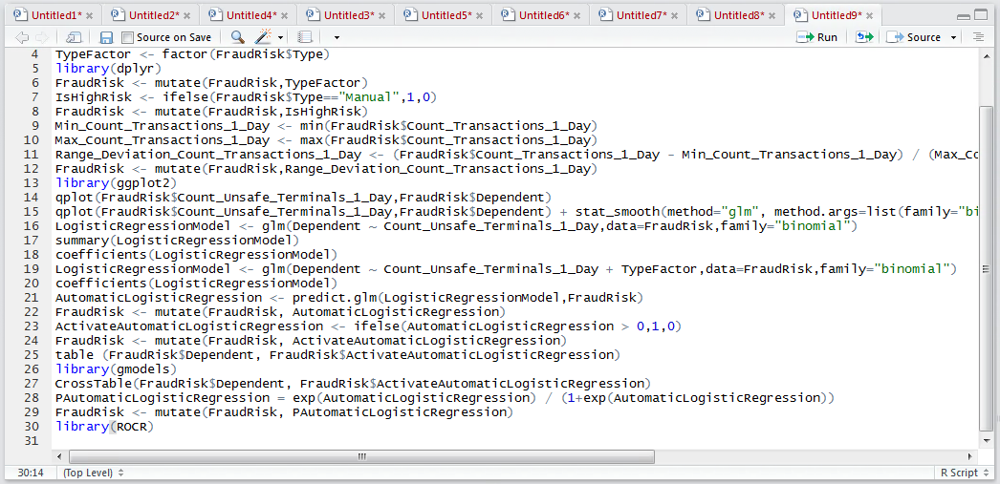

# Procedure 8: Creating a ROC Curve

The ROCR package provides a set of functions that simplifies the process of appraising the performance of classification models, comparing the actual outcome with a probability prediction.

Firstly, install the ROCR package from the RStudio package installation utility:


Click install to proceed with the installation:


Reference the ROC Library:

``` r
library(ROCR)
```



Run the block of script to console:


Two vectors and inputs are needed to create a visualisation, the first is the predictions expressed as a probability, the second being the actual outcome.  In this example, it will be the vector FraudRisk$ PAutomaticLogisticRegression And FraudRisk$Dependent.  To create the predictions object in ROCR:

``` r
ROCRPredictions <- prediction(FraudRisk$PAutomaticLogisticRegression, FraudRisk$Dependent)
```


Once the prediction object has been created it needs to be morphed into a performance object using the performance() function.  The performance function takes the prediction object yet also an indication as to the performance measures to be used, in this case true positive rate (tpr) vs false positive rate (fpr).  The performance function outputs an object that can be used in conjunction with the base graphic plot() function:

``` r
ROCRPerformance <- performance(ROCRPredictions,measure = "tpr",x.measure = "fpr")
```


Run the line of script to console:


Simply plot the ROCRPerformance object by passing as an argument to the plot() base graphic function:


Run the line of script to console:


It can be seen that a curve plot has been created in the plots window in RStudio:


It can be seen that the line is not diagonal, leading to an inference that the model has some predictive power.