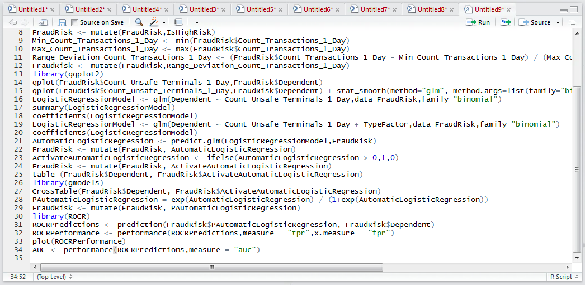
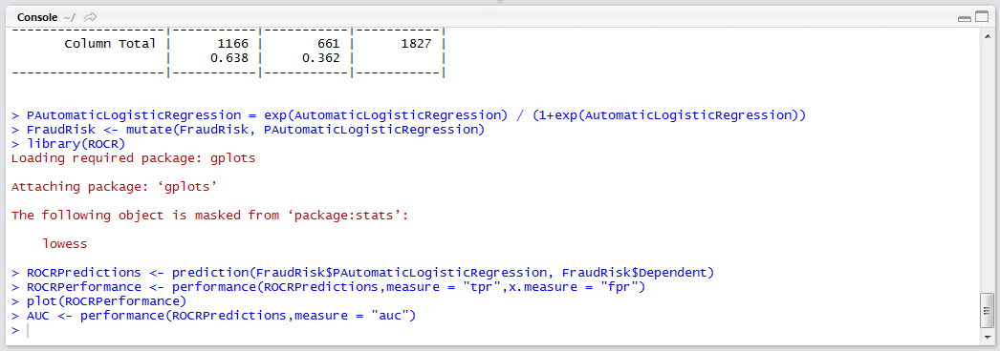
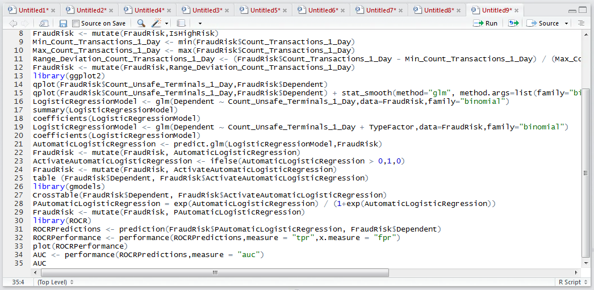
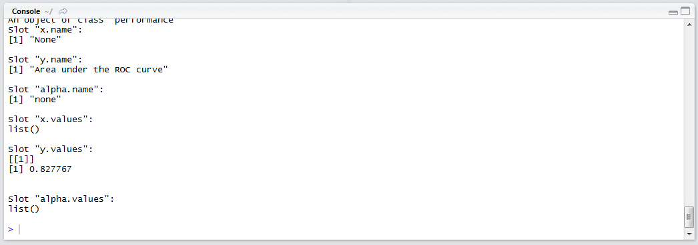
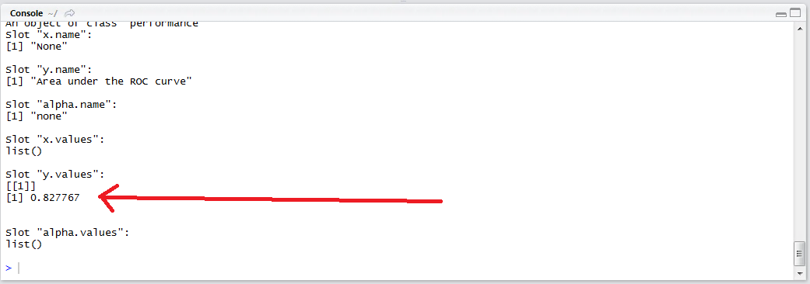

# Procedure 9: Grading the ROC Performance with AUC

Visually the plot created suggests a that the model created has some predictive power.  A more succinct method to measure model performance is the Area Under Curve statistics which can be calculated with ease by requesting "auc" as the measure to the performance object:

``` r
AUC <- performance(ROCRPredictions,measure = "auc")
```



Run the line of script to console:



To write out the contents of the AUC object:

``` r
AUC
```



Run the line of script to console:



The value to gravitate towards is the y.values,  which will have a value ranging between 0.5 and 1:



In this example, the AUC value is 0.827767 which suggests that the model has an excellent utility. By way of grading, AUC scores would correspond:

* A: Outstanding > 0.9
* B: Excellent > 0.8 and <= 0.9
* C: Acceptable > 0.7 and <= 0.8
* D: Poor > 0.6 and <= 0.7
* E: Junk > 0.5 and <= 0.6